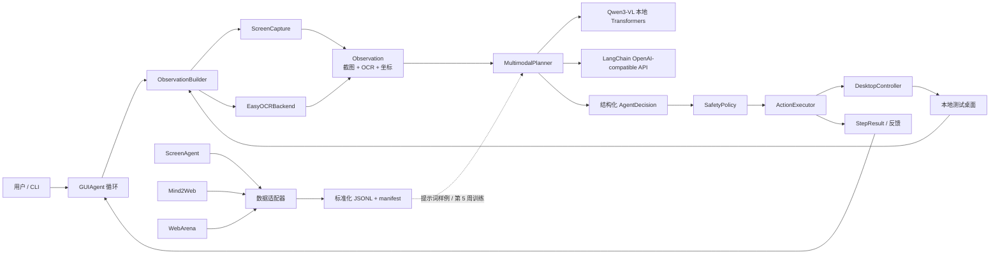

# 桌面 GUI 智能体项目：第 3-4 周实施计划

> **For agentic workers:** REQUIRED SUB-SKILL: Use `superpowers:subagent-driven-development` (recommended) or `superpowers:executing-plans` to implement this plan task-by-task. Steps use checkbox (`- [ ]`) syntax for tracking.

**状态：** 用户已批准，正在按照本文执行；任务进度以文中的复选框为准。

**Goal:** 在现有第 2 周桌面感知与安全控制模块上，完成公开 GUI 数据集预处理、基础多模态 Agent、受控的端到端观察-规划-执行-反馈闭环，以及 5 个基础桌面任务的测试报告。

**Architecture:** 保留现有 `perception/` 与 `control/` 边界，在其上增加数据集适配层、严格结构化的模型规划层、安全策略层和循环编排层。LangChain 只负责多模态消息、提示词和结构化模型输出；模型永远不能直接调用 PyAutoGUI，所有动作必须先经过本项目的类型校验、安全策略和 `DesktopController`。

**Tech Stack:** Python 3.11、uv、PyTorch CUDA 12.8、EasyOCR、LangChain、Hugging Face Datasets、Transformers、Qwen3-VL-4B-Instruct、Pydantic、pytest、Ruff、mypy。

**Spec:** `docs/大模型 AI Agent 算法岗位线上实习项目大纲：基于多模态大模型的桌面 GUI 智能体开发与优化.pdf`，重点为第 2 页的第 3、4 周表格，以及第 3-5 页的技术栈与合规说明。

## Global Constraints

- 操作系统保持 64 位 Windows；项目 Python 固定为 `>=3.11,<3.12`，不得使用系统 Python 3.13。
- GPU 为 NVIDIA GeForce RTX 5070 Ti 16 GB；沿用当前 PyTorch CUDA 12.8 配置。
- 截图仍为 `numpy.uint8` BGR 三通道，所有坐标仍为虚拟桌面物理像素绝对坐标。
- 默认必须是 `dry_run=True`；模型输出视为不可信输入，不能绕过 `DesktopController`。
- 普通测试和 GitHub CI 不访问网络、不加载真实模型、不截图、不移动鼠标、不输入文字。
- 真实模型、真实桌面和外部 API 测试统一标记为 `integration`，只能显式执行。
- 数据集、模型权重、截图、运行轨迹、日志、`.env` 和个人信息不提交 GitHub。
- 第 5 周 LoRA 微调、第 6 周自动重试/鲁棒性优化、第 7 周 20 项全面评估不进入本计划。
- 第 3 周和第 4 周分别使用独立分支及 PR；建议分支为 `codex/week3-data-agent-foundation` 和 `codex/week4-end-to-end-agent`。

---

## 1. PDF 任务内容确认

### 1.1 第 3 周：公开 GUI 数据集处理与基础 Agent 框架搭建

PDF 要求完成以下 4 项工作：

1. 下载并预处理 ScreenAgent、WebArena、Mind2Web 等公开 GUI 任务数据集。
2. 基于 LangChain 或 LlamaIndex 搭建基础多模态 Agent 框架。
3. 实现简单任务拆解与规划能力。
4. 开发大模型调用接口，支持开源多模态模型本地部署与 API 调用。

PDF 指定的数据与工具来源：Hugging Face Datasets、GitHub 开源数据集仓库、LangChain/LlamaIndex，以及 Qwen-VL、GLM-4V、Llama 3.2 Vision 等开源多模态模型。

**第 3 周交付物：** 数据集预处理脚本 + 基础 Agent 框架代码。

### 1.2 第 4 周：端到端 GUI 任务执行系统集成

PDF 要求完成以下 4 项工作：

1. 无缝集成感知模块、控制模块和 Agent 框架。
2. 实现“用户指令 -> 屏幕感知 -> 任务规划 -> 动作执行 -> 结果反馈”的完整闭环。
3. 开发简单命令行交互界面。
4. 测试并调试 5 个基础任务：打开浏览器、搜索指定内容、打开指定文件、发送消息、关闭应用。

**第 4 周交付物：** 端到端 GUI 智能体系统原型 v1.0 + 基础任务测试报告。

### 1.3 本计划对 PDF 的解释边界

- “处理数据集”指编写可复现的下载/读取、校验、标准化和导出脚本，并用每个真实数据源的少量样本完成 smoke test；首次执行不默认下载全部大文件。
- WebArena 第 3 周只处理任务定义和公开轨迹，不部署整套自托管网站；完整 WebArena 环境属于后续评估工作。
- PDF 写的是 Qwen-VL 系列。本计划选择当前官方小型版本 `Qwen/Qwen3-VL-4B-Instruct`，原因是它保留 GUI/视觉能力，约 8.9 GB 权重更适合本机 16 GB 显存。
- PDF 要求 LangChain/LlamaIndex 二选一。本计划选择 LangChain，不同时引入 LlamaIndex，避免两套 Agent 抽象并存。
- “发送消息”只在本地测试 GUI 中发送到测试收件箱，不连接真实聊天账号，也不向任何第三方发送内容。

---

## 2. 需要用户审阅的方案选择

| 决策 | 推荐方案 | 原因 | 未采用方案 |
|---|---|---|---|
| Agent 框架 | LangChain 位于模型边界，项目自行维护安全循环 | 满足 PDF，同时保留现有控制安全门和可测试性 | 让 LangChain Agent 直接暴露鼠标工具；风险过高且难以确定性测试 |
| 本地模型 | Qwen3-VL-4B-Instruct + Transformers | 官方模型、大小适合 16 GB 显存、支持图像和文本 | 默认 7B/11B 模型；显存余量较小，首次集成风险更高 |
| API 模型 | OpenAI-compatible 接口，通过 LangChain `ChatOpenAI(base_url=...)` | 可连接远端服务或 WSL2/Linux 中的 vLLM | 为每家 API 写独立客户端；重复且不利于替换 |
| 原生 Windows 部署 | Transformers 直接加载模型 | vLLM 官方不原生支持 Windows | 在当前 Windows 环境直接安装 vLLM |
| 数据集处理 | 统一 JSONL schema + manifest；默认每源 100 条 | 可复现、可检查、不会先下载超大数据 | 一开始完整复制全部数据到仓库 |
| 端到端测试 | CI 使用 fake；人工集成使用本地测试 GUI 和受控 Windows 应用 | 不触碰真实账号和个人数据 | 在 CI 或自动脚本中操作真实桌面/发送真实消息 |
| 真实执行确认 | 默认 dry-run；`--execute` 后仍逐动作确认 | 模型可能产生错误坐标或不可逆操作 | 一次确认后允许无限制自动点击 |

如果用户不修改上述表格，后续执行将按“推荐方案”实施。

---

## 3. 当前代码基线与衔接点

第 2 周已经提供：

- `ScreenCapture.capture_monitor()` / `capture_region()`：输出 `ScreenshotResult`。
- `EasyOCRBackend.recognize()`：输出屏幕绝对坐标的 `OCRDetection`。
- `find_text()` 和 `annotate_detections()`：文本定位和非破坏式标注。
- `DesktopController`：移动、点击、输入、快捷键、滚动和拖拽，默认 dry-run。
- `Point`、`ScreenRegion`、`BoundingBox` 等严格数据类型。
- Windows Python 3.11 CI、Ruff、mypy、pytest 和 93% 基线覆盖率。

第 3、4 周不重写这些模块，只通过公开接口组合它们。开始执行前必须确保第 2 周修复已合并到远程默认分支，然后从最新默认分支创建第 3 周分支。

---

## 4. 目标架构



核心边界：

- 模型只能产生结构化 `AgentDecision`，不能获得 PyAutoGUI、文件系统或 shell 对象。
- `SafetyPolicy` 拒绝非法坐标、不支持的按键、空文本、超长文本、超步数和未确认的真实动作。
- `ActionExecutor` 是 Agent 层调用 `DesktopController` 的唯一入口。
- 每个循环都重新截图；不复用上一帧坐标执行下一步。
- 第 4 周只实现基本闭环，不提前实现第 6 周的自动重试和复杂恢复。

---

## 5. 计划新增或修改的文件

```text
pyproject.toml                              # agent/datasets/local-model 可选依赖
uv.lock                                    # 锁定新增依赖
.env.example                               # 只放变量名和本地示例，不放密钥
.gitignore                                 # 忽略 external/、运行轨迹和模型缓存

src/gui_agent/
├── cli.py                                 # dataset/model/agent 子命令
├── __init__.py                            # main() 转发 CLI，版本更新
├── datasets/
│   ├── __init__.py
│   ├── schema.py                          # NormalizedGUIRecord 与 manifest
│   ├── screenagent.py                     # ScreenAgent 适配器
│   ├── mind2web.py                        # Mind2Web 流式适配器
│   ├── webarena.py                        # WebArena 任务定义适配器
│   └── pipeline.py                        # 校验、限制、JSONL 输出和统计
└── agent/
    ├── __init__.py
    ├── types.py                           # 计划、动作、决策、观察、运行结果
    ├── prompts.py                         # 计划和下一动作提示词
    ├── planner.py                         # MultimodalPlanner 协议与 LangChain 实现
    ├── qwen.py                            # Windows Transformers 本地模型实现
    ├── observation.py                     # 截图 + OCR 组合
    ├── policy.py                          # 动作安全策略与确认
    ├── executor.py                        # AgentAction -> DesktopController
    └── loop.py                            # 有最大步数的观察-规划-执行-反馈循环

scripts/
└── prepare_gui_datasets.py                # 数据集预处理 CLI

examples/
├── model_smoke.py                         # 合成界面的单次模型调用
├── agent_demo.py                          # dry-run 端到端演示
└── gui_testbed.py                         # 本地 Browser/Files/Messages 测试 GUI

configs/
└── week4_tasks.json                       # 5 个无个人数据的任务定义和成功条件

tests/
├── fixtures/gui_datasets/                 # 极小、脱敏 JSON fixture；不提交截图
├── test_dataset_schema.py
├── test_dataset_adapters.py
├── test_agent_types.py
├── test_agent_planner.py
├── test_agent_observation.py
├── test_agent_policy.py
├── test_agent_executor.py
├── test_agent_loop.py
├── test_agent_cli.py
└── integration/
    ├── test_local_qwen.py                 # 显式 integration
    └── test_week4_tasks.py                # 人工桌面测试入口

docs/
├── setup/model-provider-setup.md
└── test-reports/
    ├── week3-agent-foundation-report.md
    └── week4-agent-system-report.md
```

`data/`、`external/`、`models/`、`artifacts/agent-runs/` 和真实图片继续被 Git 忽略。

---

## 6. 核心接口和数据格式

### 6.1 模型动作必须是判别联合类型

`src/gui_agent/agent/types.py` 使用 Pydantic 定义严格 JSON schema。动作集合只覆盖第 2 周控制器已有能力，加上不会触碰桌面的 `wait` 和 `finish`：

```python
class ClickAction(BaseModel):
    kind: Literal["click"]
    x: int
    y: int
    button: Literal["left", "middle", "right"] = "left"
    clicks: int = Field(default=1, ge=1, le=2)


class TypeTextAction(BaseModel):
    kind: Literal["type_text"]
    text: str = Field(min_length=1, max_length=500)


class HotkeyAction(BaseModel):
    kind: Literal["hotkey"]
    keys: tuple[str, ...] = Field(min_length=1, max_length=4)


class ScrollAction(BaseModel):
    kind: Literal["scroll"]
    clicks: int = Field(ge=-20, le=20)
    x: int | None = None
    y: int | None = None


class DragAction(BaseModel):
    kind: Literal["drag"]
    start_x: int
    start_y: int
    end_x: int
    end_y: int
    duration: float = Field(default=0.5, ge=0.0, le=5.0)


class WaitAction(BaseModel):
    kind: Literal["wait"]
    seconds: float = Field(ge=0.0, le=5.0)


class FinishAction(BaseModel):
    kind: Literal["finish"]
    success: bool
    summary: str = Field(min_length=1, max_length=500)
```

`AgentDecision` 包含：`current_step_id`、不超过 500 字的 `rationale_summary`、一个动作和 `expected_outcome`。只保存简短理由，不要求或记录模型隐藏思维链。

### 6.2 观察和 Agent 状态

```python
@dataclass(frozen=True, slots=True)
class Observation:
    screenshot: ScreenshotResult
    detections: tuple[OCRDetection, ...]
    step_index: int


@dataclass(frozen=True, slots=True)
class AgentState:
    goal: str
    plan: TaskPlan
    observation: Observation
    decisions: tuple[AgentDecision, ...]
    results: tuple[StepResult, ...]
```

传给模型的内容包括用户目标、当前计划、最近动作结果、压缩后的 OCR 文本和当前截图。截图只在本地模型中保持内存数据；远程 API 必须显式增加 `--allow-remote-image`。

### 6.3 数据集标准化格式

每行 JSONL 是一个 `NormalizedGUIRecord`：

```json
{
  "schema_version": 1,
  "source": "screenagent",
  "record_type": "trajectory_step",
  "split": "train",
  "episode_id": "example-session",
  "step_index": 0,
  "instruction": "Open the browser",
  "image_path": "images/example.jpg",
  "action": {"kind": "click", "x": 410, "y": 220},
  "success_criteria": null,
  "source_revision": "git-sha-or-dataset-revision"
}
```

WebArena 的任务定义使用 `record_type="task"`，允许 `action=null`，但必须具有 `success_criteria`。轨迹记录必须具有 `image_path` 或文本观察之一以及合法动作。每个输出目录同时生成 `manifest.json`，记录源地址、版本、许可说明、样本数、跳过数和 SHA-256。

---

# 第 3 周执行计划

## Task 1: 建立第 3 周分支、依赖组和安全配置

**Files:**
- Modify: `pyproject.toml`
- Modify: `uv.lock`
- Modify: `.gitignore`
- Create: `.env.example`

**Produces:** `agent`、`datasets`、`local-model` 三组可选依赖；基础 CI 不安装大模型依赖。

- [x] **Step 1: 确认基线和分支**

```powershell
git status --short --branch
git switch master
git pull --ff-only
git switch -c codex/week3-data-agent-foundation
uv lock --check
uv run pytest -m "not integration" --cov=gui_agent --cov-report=term-missing
```

预期：工作区干净，现有 154 项或更新后的基线测试全部通过。

- [x] **Step 2: 增加可选依赖**

`agent` 包含 `langchain>=1,<2`、`langchain-openai>=1,<2`、`pydantic>=2,<3`；`datasets` 包含 `datasets>=4,<5`；`local-model` 包含 `transformers>=5,<6`、`accelerate>=1,<2` 和 `safetensors>=0.6,<1`。PyTorch 继续复用现有 `ocr` extra，不重复声明。

- [x] **Step 3: 增加安全配置模板**

`.env.example` 只列出：

```dotenv
GUI_AGENT_API_BASE=http://127.0.0.1:8000/v1
GUI_AGENT_API_KEY=
GUI_AGENT_MODEL=Qwen/Qwen3-VL-4B-Instruct
```

`.gitignore` 新增 `external/`、`artifacts/agent-runs/` 和 Hugging Face 缓存目录。

- [x] **Step 4: 锁定并验证依赖**

```powershell
uv lock
uv sync --extra ocr --extra agent --extra datasets --extra local-model
uv run python -c "import langchain, datasets, transformers; print('agent dependencies ok')"
```

- [x] **Step 5: 提交**

```powershell
git add pyproject.toml uv.lock .gitignore .env.example
git commit -m "chore: add Week 3 agent dependencies"
```

## Task 2: 定义 Agent 动作、计划和数据集 schema

**Files:**
- Create: `src/gui_agent/agent/types.py`
- Create: `src/gui_agent/agent/__init__.py`
- Create: `src/gui_agent/datasets/schema.py`
- Create: `src/gui_agent/datasets/__init__.py`
- Create: `tests/test_agent_types.py`
- Create: `tests/test_dataset_schema.py`

**Produces:** `AgentAction`、`AgentDecision`、`TaskPlan`、`Observation`、`AgentState`、`NormalizedGUIRecord`、`DatasetManifest`。

- [x] **Step 1: 先写失败测试**

覆盖合法动作 JSON、未知动作拒绝、坐标类型、文本长度、任务步骤数量、轨迹缺少动作、WebArena 任务缺少成功条件等行为。

```powershell
uv run pytest tests/test_agent_types.py tests/test_dataset_schema.py -v
```

预期：因模块尚不存在而失败。

- [x] **Step 2: 实现最小严格 schema**

实现第 6 节定义的类型；Pydantic 模型使用 `ConfigDict(extra="forbid", frozen=True)`，拒绝模型偷偷增加未定义字段。

- [x] **Step 3: 验证通过并检查类型**

```powershell
uv run pytest tests/test_agent_types.py tests/test_dataset_schema.py -v
uv run mypy src/gui_agent/agent src/gui_agent/datasets tests/test_agent_types.py tests/test_dataset_schema.py
```

- [x] **Step 4: 提交**

```powershell
git add src/gui_agent/agent src/gui_agent/datasets tests/test_agent_types.py tests/test_dataset_schema.py
git commit -m "feat: define GUI agent and dataset schemas"
```

## Task 3: 实现三个公开数据集适配器

**Files:**
- Create: `src/gui_agent/datasets/screenagent.py`
- Create: `src/gui_agent/datasets/mind2web.py`
- Create: `src/gui_agent/datasets/webarena.py`
- Create: `src/gui_agent/datasets/pipeline.py`
- Create: `scripts/prepare_gui_datasets.py`
- Create: `tests/fixtures/gui_datasets/`
- Create: `tests/test_dataset_adapters.py`

**Consumes:** `NormalizedGUIRecord`、`DatasetManifest`。

**Produces:** 每个源的标准化 JSONL 和 manifest；无效样本计数，不静默吞掉错误。

- [x] **Step 1: 为三个最小脱敏 fixture 写失败测试**

每个 fixture 只含 1-2 条手写结构数据，不复制数据集图片。测试字段映射、动作坐标、任务成功条件、`--limit`、确定性排序和无效记录报告。

```powershell
uv run pytest tests/test_dataset_adapters.py -v
```

- [x] **Step 2: 实现纯适配函数**

```python
def iter_screenagent(root: Path, *, split: str) -> Iterator[NormalizedGUIRecord]: ...
def iter_mind2web(rows: Iterable[Mapping[str, object]]) -> Iterator[NormalizedGUIRecord]: ...
def iter_webarena(config_dir: Path) -> Iterator[NormalizedGUIRecord]: ...
def write_dataset(records: Iterable[NormalizedGUIRecord], output: Path) -> DatasetManifest: ...
```

适配函数不负责网络下载；Mind2Web CLI 层可使用 `load_dataset(..., streaming=True)`。

- [x] **Step 3: 实现预处理 CLI**

```powershell
uv run python scripts/prepare_gui_datasets.py --help
```

CLI 必须提供 `screenagent`、`mind2web`、`webarena` 子命令以及 `--limit`、`--revision`、`--output`。

- [x] **Step 4: 用真实来源做限量 smoke test**

```powershell
git clone --depth 1 https://github.com/niuzaisheng/ScreenAgent external/ScreenAgent
git clone --depth 1 https://github.com/web-arena-x/webarena external/webarena

uv run python scripts/prepare_gui_datasets.py screenagent `
  --input external/ScreenAgent/data/ScreenAgent `
  --output data/processed/screenagent --limit 100

uv run python scripts/prepare_gui_datasets.py mind2web `
  --dataset osunlp/Mind2Web --split train --stream `
  --output data/processed/mind2web --limit 100

uv run python scripts/prepare_gui_datasets.py webarena `
  --input external/webarena/config_files `
  --output data/processed/webarena --limit 100
```

预期：三个输出目录都有 JSONL 和 manifest；`git status` 不出现数据文件。若上游目录结构变更，适配器必须给出包含源路径的明确错误，而不是猜测路径。

- [x] **Step 5: 提交**

```powershell
git add src/gui_agent/datasets scripts/prepare_gui_datasets.py tests/fixtures/gui_datasets tests/test_dataset_adapters.py
git commit -m "feat: preprocess public GUI task datasets"
```

## Task 4: 实现提示词、Planner 协议和确定性 fake

**Files:**
- Create: `src/gui_agent/agent/prompts.py`
- Create: `src/gui_agent/agent/planner.py`
- Create: `tests/test_agent_planner.py`

**Produces:**

```python
class MultimodalPlanner(Protocol):
    def create_plan(self, goal: str, observation: Observation) -> TaskPlan: ...
    def next_action(self, state: AgentState) -> AgentDecision: ...
```

- [x] **Step 1: 写 fake planner 和提示词失败测试**

测试提示词必须包含目标、允许动作、屏幕尺寸、OCR 摘要、当前步骤和最近结果；不得包含 API key、绝对本地数据路径或隐藏思维链要求。

- [x] **Step 2: 实现共享 prompt builder 和 `FakePlanner`**

`FakePlanner` 接收预设计划与决策队列，用于所有普通 CI 端到端测试。

- [x] **Step 3: 验证**

```powershell
uv run pytest tests/test_agent_planner.py -v
uv run ruff check src/gui_agent/agent tests/test_agent_planner.py
uv run mypy src/gui_agent/agent tests/test_agent_planner.py
```

- [x] **Step 4: 提交**

```powershell
git add src/gui_agent/agent/prompts.py src/gui_agent/agent/planner.py tests/test_agent_planner.py
git commit -m "feat: add structured multimodal planner boundary"
```

## Task 5: 实现 LangChain API Planner 与本地 Qwen Planner

**Files:**
- Modify: `src/gui_agent/agent/planner.py`
- Create: `src/gui_agent/agent/qwen.py`
- Create: `examples/model_smoke.py`
- Modify: `tests/test_agent_planner.py`
- Create: `tests/integration/test_local_qwen.py`

**Produces:** `LangChainPlanner` 和 `QwenTransformersPlanner`，二者满足同一 `MultimodalPlanner` 协议。

- [ ] **Step 1: 写依赖注入测试**

测试使用 fake LangChain chat model 和 fake Transformers pipeline；断言截图被编码为图像消息、结构化输出被验证、模型错误保留原异常为 `__cause__`、未允许时拒绝远程图片。

- [ ] **Step 2: 实现 OpenAI-compatible API 路径**

`LangChainPlanner` 使用 `ChatOpenAI(model=..., base_url=..., api_key=...)` 和 `with_structured_output()`；只有 `allow_remote_image=True` 时才把截图编码成 data URL。

- [ ] **Step 3: 实现 Windows 本地 Qwen 路径**

`QwenTransformersPlanner` 延迟加载 `AutoProcessor` 和 `AutoModelForImageTextToText`，默认模型为 `Qwen/Qwen3-VL-4B-Instruct`，使用 `torch.bfloat16`、`device_map="auto"`，并限制截图长边和模型输出 token 数以控制显存。

- [ ] **Step 4: 先运行合成图片 smoke test**

```powershell
uv run python examples/model_smoke.py --provider qwen `
  --model Qwen/Qwen3-VL-4B-Instruct --synthetic
```

预期：打印合法 `TaskPlan` 和单个 `AgentDecision`；不操作桌面。

- [ ] **Step 5: 显式运行集成测试**

```powershell
uv run pytest -m integration tests/integration/test_local_qwen.py -v
```

记录首次模型下载、加载时间、单次推理时间、峰值显存和模型 revision，不记录真实屏幕内容。

- [ ] **Step 6: 提交**

```powershell
git add src/gui_agent/agent examples/model_smoke.py tests/test_agent_planner.py tests/integration/test_local_qwen.py
git commit -m "feat: add local and API multimodal planners"
```

## Task 6: 完成第 3 周文档、质量门禁与 PR

**Files:**
- Create: `docs/setup/model-provider-setup.md`
- Create: `docs/test-reports/week3-agent-foundation-report.md`
- Modify: `README.md`

- [ ] **Step 1: 记录数据与模型执行方法**

文档必须包含数据源 revision、许可检查、磁盘占用、模型缓存位置、环境变量、本地/远程图片隐私差异、Windows 下不原生使用 vLLM 的原因。

- [ ] **Step 2: 跑完整门禁**

```powershell
uv lock --check
uv run ruff check .
uv run mypy src tests examples scripts
uv run pytest -m "not integration" --cov=gui_agent --cov-report=term-missing
git diff --check
```

- [ ] **Step 3: 第 3 周验收**

- 三个数据适配器都能处理 fixture，真实来源每个至少成功处理 10 条。
- `FakePlanner`、`LangChainPlanner`、`QwenTransformersPlanner` 满足同一接口。
- 本地 Qwen 对合成界面产生可解析计划与动作。
- 普通测试不访问网络/桌面/模型。
- 数据、模型、图片和密钥没有进入 Git diff。

- [ ] **Step 4: 提交、推送、PR**

```powershell
git add README.md docs/setup/model-provider-setup.md docs/test-reports/week3-agent-foundation-report.md
git commit -m "docs: add Week 3 agent foundation report"
git push -u origin codex/week3-data-agent-foundation
gh pr create --draft --base master --head codex/week3-data-agent-foundation
```

CI 通过并人工审阅后合并，再创建 `v0.3.0-week3` 标签。

---

# 第 4 周执行计划

## 第 4 周启动前置步骤

第 3 周 PR 通过审阅并合并后，从最新的 `master` 创建独立分支，并先复验第 3 周基线：

```powershell
git switch master
git pull --ff-only
git switch -c codex/week4-end-to-end-agent
uv sync --group dev --extra ocr --extra agent
uv run pytest -q
```

只有上述测试通过后才开始 Task 7；若第 3 周尚未合并，则暂停第 4 周实现，不跨分支复制代码。

## Task 7: 构建 ObservationBuilder

**Files:**
- Create: `src/gui_agent/agent/observation.py`
- Create: `tests/test_agent_observation.py`

**Consumes:** `ScreenCapture`、`OCRBackend`。

**Produces:** `ObservationBuilder.observe(step_index: int) -> Observation`。

- [ ] **Step 1: 写失败测试**

使用 fake capture 和 fake OCR 验证：截图只捕获一次、OCR 使用截图原点、检测结果转为 tuple、错误不被吞掉、不会保存截图。

- [ ] **Step 2: 实现最小组合层**

该层不包含模型、不执行动作，也不依赖 LangChain。

- [ ] **Step 3: 验证并提交**

```powershell
uv run pytest tests/test_agent_observation.py -v
git add src/gui_agent/agent/observation.py tests/test_agent_observation.py
git commit -m "feat: build agent observations from desktop perception"
```

## Task 8: 实现安全策略和动作执行器

**Files:**
- Create: `src/gui_agent/agent/policy.py`
- Create: `src/gui_agent/agent/executor.py`
- Create: `tests/test_agent_policy.py`
- Create: `tests/test_agent_executor.py`

**Consumes:** `AgentAction`、`Observation`、`DesktopController`。

**Produces:** `SafetyPolicy.authorize()` 与 `ActionExecutor.execute()`。

- [ ] **Step 1: 写安全失败测试**

覆盖屏幕外坐标、未支持按键、超长文本、零/负等待、未确认 live 动作、模型请求 shell/文件删除等不存在的动作类型，以及 dry-run 绝不实例化真实 PyAutoGUI。

- [ ] **Step 2: 实现 fail-closed 策略**

策略只接受 schema 中的动作；真实模式默认逐动作显示“动作、坐标/文本摘要、预期结果”，用户输入完整确认短语后才执行。输入文本在确认显示中截断并转义，日志不记录潜在密码。

- [ ] **Step 3: 映射现有控制器**

`click`、`type_text`、`hotkey`、`scroll`、`drag` 映射到 `DesktopController`；`wait` 使用可注入 clock；`finish` 不调用控制器。

- [ ] **Step 4: 验证并提交**

```powershell
uv run pytest tests/test_agent_policy.py tests/test_agent_executor.py -v
git add src/gui_agent/agent/policy.py src/gui_agent/agent/executor.py tests/test_agent_policy.py tests/test_agent_executor.py
git commit -m "feat: validate and execute planned desktop actions"
```

## Task 9: 实现观察-规划-执行-反馈循环

**Files:**
- Create: `src/gui_agent/agent/loop.py`
- Create: `tests/test_agent_loop.py`

**Produces:**

```python
class GUIAgent:
    def run(self, goal: str, *, max_steps: int = 10) -> AgentRunResult: ...
```

- [ ] **Step 1: 写确定性闭环测试**

用 `FakePlanner`、fake observations 和 dry-run executor 验证：先观察再规划、每个动作后重新观察、结果进入下一轮、`finish` 正常停止、最大步数停止、planner/观察/执行错误返回明确失败状态。

- [ ] **Step 2: 实现最小循环**

流程严格为：`observe -> create_plan（仅首次） -> next_action -> authorize -> execute -> StepResult -> observe`。第 4 周不自动重试；任何异常都停止并保留已经完成的步骤记录。

- [ ] **Step 3: 增加无进展保护**

连续两次完全相同动作或超过 `max_steps` 时停止并返回 `stopped`，不继续点击。更复杂的视觉差异和自动重试留到第 6 周。

- [ ] **Step 4: 验证并提交**

```powershell
uv run pytest tests/test_agent_loop.py -v
git add src/gui_agent/agent/loop.py tests/test_agent_loop.py
git commit -m "feat: add bounded GUI agent execution loop"
```

## Task 10: 开发命令行界面和本地 GUI Testbed

**Files:**
- Create: `src/gui_agent/cli.py`
- Modify: `src/gui_agent/__init__.py`
- Create: `examples/agent_demo.py`
- Create: `examples/gui_testbed.py`
- Create: `configs/week4_tasks.json`
- Create: `tests/test_agent_cli.py`

- [ ] **Step 1: 写 CLI 失败测试**

覆盖 `--help`、缺少 task、非法 provider、`max_steps`、dry-run 默认、远程图片授权和 `--execute` 确认失败。

- [ ] **Step 2: 实现命令**

```powershell
uv run gui-agent dataset --help
uv run gui-agent model-smoke --help
uv run gui-agent run --help
```

`run` 参数至少包括 `--task` / `--task-id`、`--provider fake|qwen|openai-compatible`、`--model`、`--monitor`、`--max-steps`、`--execute`、`--allow-remote-image` 和 `--trace-dir`。

- [ ] **Step 3: 实现本地 Testbed**

用 Python 标准库 Tkinter 创建无外部账号的窗口，包含 Browser、Files、Messages 三个区域和可查询的成功状态。消息只写入该进程内存；测试文件只来自 `artifacts/testbed/`；关闭操作只关闭 Testbed 自身。

- [ ] **Step 4: dry-run 演示**

```powershell
uv run python examples/gui_testbed.py
uv run gui-agent run --task-id search-local-content --provider fake --max-steps 6
```

预期：第二条命令只打印计划动作，不移动鼠标。

- [ ] **Step 5: 提交**

```powershell
git add src/gui_agent/cli.py src/gui_agent/__init__.py examples/agent_demo.py examples/gui_testbed.py configs/week4_tasks.json tests/test_agent_cli.py
git commit -m "feat: add GUI agent CLI and safe testbed"
```

## Task 11: 执行并记录 5 个基础任务

**Files:**
- Create: `tests/integration/test_week4_tasks.py`
- Create: `docs/test-reports/week4-agent-system-report.md`

人工集成测试必须在用户明确开始后执行；每次运行先 dry-run，再逐动作确认 live 模式。

| ID | PDF 任务 | 受控测试方法 | 成功条件 |
|---|---|---|---|
| `open-browser` | 打开浏览器 | Windows 开始菜单打开默认浏览器，或打开 Testbed Browser | 重新截图后出现预期浏览器标题/OCR 文本 |
| `search-content` | 搜索指定内容 | Testbed 搜索框；可选真实浏览器搜索非敏感固定词 | 结果区出现固定目标词 |
| `open-file` | 打开指定文件 | 打开 `artifacts/testbed/week4-demo.txt` | 编辑器/Testbed 显示固定文件名和内容标记 |
| `send-message` | 发送消息 | Testbed Messages 发送 `week4 test message` | 本地测试收件箱出现完全相同文本 |
| `close-app` | 关闭应用 | 只关闭 Testbed 或专用测试编辑器 | 进程/窗口退出，其他应用不受影响 |

- [ ] **Step 1: 启动 Testbed 并逐项 dry-run**

```powershell
uv run python examples/gui_testbed.py
uv run gui-agent run --task-id open-browser --provider qwen --max-steps 8
uv run gui-agent run --task-id search-content --provider qwen --max-steps 8
uv run gui-agent run --task-id open-file --provider qwen --max-steps 8
uv run gui-agent run --task-id send-message --provider qwen --max-steps 8
uv run gui-agent run --task-id close-app --provider qwen --max-steps 8
```

- [ ] **Step 2: 用户确认后执行 live 测试**

在每条命令增加 `--execute`。每个动作仍要求逐步确认；PyAutoGUI fail-safe 保持开启；用户可把鼠标移到屏幕角落中止。

- [ ] **Step 3: 写测试报告**

每项记录：模型 revision、分辨率、任务结果、动作数、总耗时、失败阶段和人工干预次数。报告不嵌入真实截图、不记录屏幕文字全文、不记录输入法内容或 API key。

- [ ] **Step 4: 提交**

```powershell
git add tests/integration/test_week4_tasks.py docs/test-reports/week4-agent-system-report.md
git commit -m "test: report Week 4 desktop agent tasks"
```

## Task 12: 第 4 周全量验收和交付

- [ ] **Step 1: 普通质量门禁**

```powershell
uv lock --check
uv run ruff check .
uv run mypy src tests examples scripts
uv run pytest -m "not integration" --cov=gui_agent --cov-report=term-missing
git diff --check
```

- [ ] **Step 2: 隐私与仓库检查**

```powershell
git status --short
git ls-files data external models artifacts .env
```

预期：第二条命令没有列出数据集、模型、截图、运行轨迹或密钥。

- [ ] **Step 3: 第 4 周验收标准**

- CLI 能接收自然语言任务并选择 fake、本地 Qwen 或 OpenAI-compatible provider。
- fake 路径在 CI 中完成完整闭环，不访问真实桌面。
- 本地 Qwen 路径至少完成合成界面的计划和动作生成。
- 真实模式默认逐动作确认，非法/越界/未知动作全部 fail closed。
- 5 个规定任务都有 dry-run 记录和人工集成结果。
- 系统在 `finish`、最大步数、重复动作和异常时可控停止。
- Week 4 报告包含任务成功率、动作数和耗时，但不泄露个人数据。

- [ ] **Step 4: 推送和 PR**

```powershell
git push -u origin codex/week4-end-to-end-agent
gh pr create --draft --base master --head codex/week4-end-to-end-agent
```

CI 与人工审阅通过并合并后创建 `v0.4.0-week4` 标签；报告中的产品阶段名称使用 PDF 规定的“端到端 GUI 智能体系统原型 v1.0”。

---

## 7. 从零开始的执行顺序

用户批准本文后，按以下顺序执行：

1. 确认第 2 周 PR 已合并，更新 `master`，运行现有测试。
2. 创建第 3 周分支，完成 Task 1-6，提交 Draft PR。
3. 用户审阅第 3 周 PR；CI 通过后合并。
4. 从更新后的 `master` 创建第 4 周分支，完成 Task 7-10。
5. 先用 fake 和 dry-run 完成端到端验证。
6. 用户在场时执行 Task 11 的真实桌面测试。
7. 完成 Task 12、报告、Draft PR 和远端 CI。

推荐在后续执行时使用 `superpowers:subagent-driven-development`，每个 Task 独立实现、规格检查和代码质量检查；若不使用子任务代理，则使用 `superpowers:executing-plans` 分批执行，并在 Task 6、Task 10、Task 12 后停下汇报。

---

## 8. 预计运行命令速查

### 安装

```powershell
uv sync --extra ocr --extra agent --extra datasets --extra local-model
uv run python -c "import torch; print(torch.cuda.is_available(), torch.cuda.get_device_name(0))"
```

### 数据处理

```powershell
uv run python scripts/prepare_gui_datasets.py --help
uv run python scripts/prepare_gui_datasets.py mind2web --dataset osunlp/Mind2Web --split train --stream --output data/processed/mind2web --limit 100
```

### 模型检查

```powershell
uv run python examples/model_smoke.py --provider qwen --model Qwen/Qwen3-VL-4B-Instruct --synthetic
```

### 默认安全运行

```powershell
uv run gui-agent run --task "在本地测试窗口中搜索指定内容" --provider qwen --max-steps 8
```

### 用户确认后的真实运行

```powershell
uv run gui-agent run --task-id search-content --provider qwen --max-steps 8 --execute
```

### 测试

```powershell
uv run ruff check .
uv run mypy src tests examples scripts
uv run pytest -m "not integration" --cov=gui_agent --cov-report=term-missing
uv run pytest -m integration tests/integration/test_local_qwen.py -v
```

---

## 9. 风险与处理方式

| 风险 | 本计划中的处理 |
|---|---|
| 16 GB 显存不足 | 默认 4B 模型、BF16、限制截图尺寸和输出 token；失败时使用 API provider，不默认升级到 7B/11B |
| 原生 Windows 不支持 vLLM | 本机使用 Transformers；vLLM 仅作为 WSL2/Linux/远端 OpenAI-compatible 服务 |
| 模型生成错误坐标 | Pydantic schema、虚拟桌面边界检查、逐动作确认、每步重新截图 |
| 模型输出未知工具或任意代码 | 动作判别联合只允许白名单，未知字段和动作直接拒绝 |
| 数据集体积过大 | 默认 streaming/`--limit 100`；全量处理由用户显式启动 |
| 数据许可或上游格式变化 | manifest 记录来源/revision/许可；适配器对字段缺失明确报错 |
| API 泄露屏幕内容 | 默认本地；远程图片需要 `--allow-remote-image`，只用合成或经用户确认的画面 |
| 自动发送真实消息 | 第 4 周只向本地 Testbed 发送，不连接个人账号 |
| 应用状态变化导致旧坐标失效 | 每个动作后重新截图，下一动作必须基于新 Observation |
| Agent 无限循环 | `max_steps`、连续重复动作停止、用户逐动作确认、PyAutoGUI fail-safe |

---

## 10. 参考来源

- 项目 PDF：`docs/大模型 AI Agent 算法岗位线上实习项目大纲：基于多模态大模型的桌面 GUI 智能体开发与优化.pdf`
- ScreenAgent 官方仓库：<https://github.com/niuzaisheng/ScreenAgent>
- WebArena 官方仓库：<https://github.com/web-arena-x/webarena>
- Mind2Web 官方数据集：<https://huggingface.co/datasets/osunlp/Mind2Web>
- Multimodal Mind2Web：<https://huggingface.co/datasets/osunlp/Multimodal-Mind2Web>
- LangChain Agents：<https://docs.langchain.com/oss/python/langchain/agents>
- LangChain structured output：<https://docs.langchain.com/oss/python/langchain/structured-output>
- Qwen3-VL-4B-Instruct 官方模型卡：<https://huggingface.co/Qwen/Qwen3-VL-4B-Instruct>
- Hugging Face Datasets streaming：<https://huggingface.co/docs/datasets/main/stream>
- vLLM GPU 安装与 Windows 说明：<https://docs.vllm.ai/en/latest/getting_started/installation/gpu/>

---

## 11. 审阅清单

请重点确认以下 5 项：

1. 是否同意用 LangChain 作为模型/结构化输出边界，而不是让框架直接控制桌面。
2. 是否同意本地默认模型使用 `Qwen/Qwen3-VL-4B-Instruct`。
3. 是否同意三个数据集先各处理最多 100 条进行验证，再决定是否全量下载。
4. 是否同意“发送消息”只在本地 Testbed 中测试，不发送给真实联系人。
5. 是否同意真实桌面执行保持“`--execute` + 逐动作确认”，不提供无确认全自动模式。

只有用户明确批准本文或提出修改后，才开始第 3 周实现。
