# 桌面 GUI 智能体项目：第 5-6 周执行计划

> **For agentic workers:** REQUIRED SUB-SKILL: 使用 `superpowers:subagent-driven-development`（推荐）或 `superpowers:executing-plans` 按 Task 顺序执行；每个功能先使用 `superpowers:test-driven-development`，提交或创建 PR 前使用 `superpowers:verification-before-completion`。

**状态：** 用户已批准，正在执行第 5 周；进度以本文复选框和 Git 提交为准。

**任务分类：** 架构级扩展。第 5 周会新增训练与评估子系统，第 6 周会调整 Agent 循环、感知和日志边界，因此分成两个独立分支与 PR，不能在 Week 4 的未完成分支上直接叠加。

**Goal:** 在 Week 4 的安全端到端 GUI Agent v1.0 上完成可复现的 Qwen3-VL LoRA/QLoRA 微调与前后对比，并将系统升级为支持复杂任务进度、受控重试、结果验证、感知优化和实时监控的 v2.0。

**Architecture:** 第 5 周新增独立 `training/` 包，将已标准化的公开 GUI 轨迹转换为无 episode 泄漏的训练/验证集，通过 PEFT 生成轻量 LoRA adapter，再由现有 `QwenTransformersPlanner` 可选加载。第 6 周不让模型直接控制重试，而是在现有 `GUIAgent` 外围增加严格的计划进度、结果验证、错误分类、限次重试/重规划和结构化事件流；安全策略拒绝永远不可自动重试。

**Tech Stack:** Python 3.11、uv、PyTorch CUDA 12.8、Transformers、PEFT、Accelerate、bitsandbytes、Qwen3-VL-4B-Instruct、Pydantic、OpenCV、EasyOCR、标准库 `logging`、pytest、Ruff、mypy。

**Spec:** `docs/大模型 AI Agent 算法岗位线上实习项目大纲：基于多模态大模型的桌面 GUI 智能体开发与优化.pdf`，重点为第 2 页的第 5、6 周表格，以及第 3-5 页的技术栈与合规说明。现有架构基线见 `docs/PROJECT_PLAN_WEEKS_3_4.md`。

---

## 1. PDF 任务确认

### 1.1 第 5 周：多模态大模型 LoRA 微调与能力提升

PDF 明确要求：

1. 基于预处理后的公开 GUI 数据集构建微调训练集和验证集。
2. 使用 PEFT 对开源多模态模型进行 LoRA 微调。
3. 对比微调前后模型在 GUI 任务理解与动作生成上的效果。
4. 优化提示词工程，提升任务执行准确率。

**PDF 交付物：** 微调后的模型权重 + 微调效果对比分析报告。

### 1.2 第 6 周：高级功能与系统鲁棒性优化

PDF 明确要求：

1. 实现复杂任务的自动拆解与分步执行。
2. 开发错误检测与自动重试机制，提高容错性。
3. 优化屏幕感知模块，提高 UI 元素识别准确率与速度。
4. 实现任务执行状态的实时监控与日志记录。

**PDF 交付物：** 优化后的系统 v2.0 + 鲁棒性测试报告。

### 1.3 本计划的解释边界

- “模型权重”指 LoRA adapter（`adapter_model.safetensors`、`adapter_config.json` 和可复现 manifest），不复制约 8.9 GB 的基础模型。
- 本机默认尝试 4-bit QLoRA，因为 RTX 5070 Ti 16 GB 不适合对 4B 多模态模型做全参数微调；若 Windows CUDA smoke test 失败，则用同一份配置和数据在 Google Colab/Linux GPU 上执行，不另写一套训练逻辑。
- LoRA 训练只使用具有可靠动作标签的 `trajectory_step`。WebArena 的纯任务记录没有动作真值，只作为固定任务理解用例的设计依据和可选非计分 smoke 输入，不伪造训练标签；正式对比指标来自有明确标注的 `week5_eval_cases.json`。
- 第 6 周的“自动重试”必须有次数上限，并且只处理可恢复错误。安全策略拒绝、用户拒绝确认、非法坐标和未知动作立即停止。
- 第 7 周要求的 20 项全面评估不提前进入本计划；第 5 周使用小型固定离线评估集，第 6 周使用故障注入鲁棒性场景。
- 训练数据、验证图像、基础模型、adapter、运行截图和详细运行日志保持 Git 忽略。GitHub 只提交代码、配置、无图像 fixture、汇总指标和文档。若需要发布 adapter，使用 GitHub Release 附件，并在上传前由用户确认。

---

## 2. 当前基线与开始条件

现有 Week 4 分支已经具备：

- `NormalizedGUIRecord` 和 ScreenAgent、Mind2Web、WebArena 适配器。
- `TaskPlan`、`AgentDecision`、`AgentState`、严格 `AgentAction` 联合类型。
- fake、OpenAI-compatible 和本地 `QwenTransformersPlanner`。
- `ObservationBuilder`、`SafetyPolicy`、`ActionExecutor` 和有最大步数/重复动作停止的 `GUIAgent`。
- 默认 dry-run、真实动作逐次输入 `EXECUTE ACTION`、PyAutoGUI fail-safe。
- Week 4 本地 Testbed 和 5 个基础任务配置。

开始 Week 5 前必须满足：

1. PR #4 已完成剩余 Week 4 测试并合并到 `master`。
2. `master` 普通测试、Ruff、mypy 全部通过。
3. Week 5 从更新后的 `origin/master` 创建新 worktree；不得直接在 `codex/week4-end-to-end-agent` 上实现。
4. 当前未跟踪的 `docs/test-reports/week4-real-desktop-operation-test.md` 属于用户文件，执行本计划时不得覆盖、删除或误提交。

建议分支：

- Week 5：`codex/week5-lora-improvement`
- Week 6：`codex/week6-robust-agent-v2`

---

## 3. 方案选择

| 决策 | 采用方案 | 原因 |
|---|---|---|
| 基础模型 | 沿用 `Qwen/Qwen3-VL-4B-Instruct` | 与 Week 3-4 推理接口一致，不引入第二套模型协议 |
| 微调方式 | 4-bit QLoRA，基础模型与视觉塔冻结，只给语言层线性模块加 LoRA | 适合 16 GB 显存，产物小，可单独加载/卸载 |
| 训练入口 | 项目内的 Transformers + PEFT + Accelerate CLI | 配置、数据 schema、测试和现有 planner 能保持一致 |
| 训练运行地 | 本机 Windows CUDA 优先；同配置 Colab/Linux 作为明确回退 | 当前 bitsandbytes 官方包已覆盖 Windows x86-64 CUDA 12.8，但仍先做单步 smoke test |
| 数据切分 | 以 `(source, episode_id)` 分组后确定性切分 | 防止同一轨迹的相邻截图同时出现在训练集与验证集 |
| 提示词优化 | 固定候选 profile 做离线 A/B，不人工挑选单个成功例 | 结果可复现，避免验证时临时改 prompt |
| 任务恢复 | 规则验证 + 可选模型语义验证；限次 retry 后最多一次 replan | 既能发现“动作执行了但界面没变化”，又防止无限循环 |
| 感知优化 | 先建立 OCR benchmark，再选择 EasyOCR/OpenCV profile，并对完全相同帧复用结果 | 优化有基线证据，不盲目更换 OCR 引擎 |
| 监控日志 | 类型化事件 + 控制台实时状态 + 脱敏 JSONL | 便于调试与统计，同时不保存完整屏幕文字和输入内容 |

不采用全参数微调、模型自行决定无限重试、默认保存截图、自动发送真实消息或绕过逐动作确认。

---

## 4. 目标架构

```mermaid
flowchart TB
    subgraph W5[Week 5：训练与评估]
        Normalized[NormalizedGUIRecord] --> Validate[样本与图片校验]
        Validate --> Split[按 episode 分组切分]
        Split --> SFT[TrainingExample JSONL]
        SFT --> Collator[Qwen 多模态 Collator]
        Collator --> QLoRA[PEFT 4-bit QLoRA]
        QLoRA --> Adapter[LoRA adapter + manifest]
        Adapter --> Planner[QwenTransformersPlanner]
        EvalCases[固定离线评估集] --> Compare[基础/微调/prompt A-B]
        Planner --> Compare
    end

    subgraph W6[Week 6：鲁棒系统 v2.0]
        User[用户任务] --> Agent[GUIAgent]
        Agent --> Progress[PlanProgress]
        Progress --> Observer[OptimizedObservationBuilder]
        Observer --> OCR[EasyOCR + OpenCV profile + frame cache]
        Progress --> Planner2[MultimodalPlanner]
        Planner2 --> Policy[SafetyPolicy]
        Policy --> Executor[ActionExecutor]
        Executor --> Verify[OutcomeVerifier]
        Verify --> Retry[RetryController]
        Retry -->|可恢复且未超限| Planner2
        Retry -->|本步骤耗尽且允许| Replan[一次受控 replan]
        Replan --> Progress
        Agent --> Events[EventSink]
        Events --> Console[实时控制台状态]
        Events --> JSONL[脱敏 JSONL 日志]
    end
```



关键安全不变量：

- `SafetyPolicy` 仍是所有桌面动作进入 `ActionExecutor` 前的唯一授权门。
- retry 生成的新动作必须重新校验、重新确认；之前的确认不能复用。
- policy denial、确认拒绝和非法动作的 `retryable=False`。
- 每次动作后重新观察；只能针对新帧验证结果和生成下一动作。
- adapter 只能改变模型输出，不能替换 policy、executor 或坐标校验。

---

## 5. 计划文件布局

```text
configs/
├── week5_qwen3vl_qlora.toml              # 唯一训练配置
├── week5_eval_cases.json                 # 小型固定离线评估集
└── week6_robustness_tasks.json           # 故障注入任务与预期恢复

src/gui_agent/
├── cli.py                                # training/benchmark-ocr 与 v2 run 参数
├── agent/
│   ├── coordinates.py                    # 1000 网格与桌面/图片坐标互转
│   ├── types.py                          # PlanProgress、Attempt/Verification 类型
│   ├── prompts.py                        # 可版本化 prompt profile 与恢复上下文
│   ├── planner.py                        # revise_plan/verify_outcome 协议边界
│   ├── qwen.py                           # 可选加载 PEFT adapter
│   ├── loop.py                           # 分步状态、验证、限次 retry/replan
│   ├── retry.py                          # 错误分类和 RetryPolicy
│   ├── verification.py                   # 规则/可选语义结果验证
│   └── events.py                         # AgentEvent、EventSink、JSONL/控制台 sink
├── perception/
│   ├── ocr.py                            # OCR profile 参数透传
│   ├── preprocessing.py                  # OpenCV 灰度/对比度/缩放流程
│   └── benchmark.py                      # OCR 指标与延迟统计
└── training/
    ├── __init__.py
    ├── config.py                         # TOML 训练配置与路径安全校验
    ├── schema.py                         # TrainingExample、manifest、eval result
    ├── dataset.py                        # 校验、分组切分和 JSONL 输出
    ├── formatting.py                     # prompt、图片与目标 JSON 格式
    ├── collator.py                       # 只对 assistant JSON 计算 loss
    ├── lora.py                           # 量化加载、LoRA 注入、保存/重载
    ├── trainer.py                        # Trainer/Accelerate 入口
    ├── evaluation.py                     # 基础/adapter/prompt 对比
    └── cli.py                            # build/check/train/evaluate 子命令

scripts/
└── benchmark_ocr.py                      # 可独立运行的感知 benchmark

tests/
├── fixtures/training/                    # 极小 JSON 和程序生成图片
├── fixtures/ocr_benchmark/               # 合成 UI 标注，不含真实桌面
├── test_training_config.py
├── test_training_schema.py
├── test_training_dataset.py
├── test_training_cli.py
├── test_training_formatting.py
├── test_training_collator.py
├── test_training_lora.py
├── test_training_evaluation.py
├── test_agent_coordinates.py
├── test_agent_progress.py
├── test_agent_retry.py
├── test_agent_verification.py
├── test_agent_events.py
├── test_perception_preprocessing.py
├── test_perception_benchmark.py
└── integration/
    ├── test_lora_smoke.py                 # 真实 GPU/模型，显式运行
    └── test_week6_robustness.py           # 本地 Testbed，显式运行

docs/
├── setup/lora-training.md
├── setup/robust-agent-v2.md
└── test-reports/
    ├── week5-lora-comparison-report.md
    └── week6-robustness-report.md
```

本地生成但不提交：

```text
data/training/week5/{train,validation}.jsonl
artifacts/week5/baseline-metrics.json
artifacts/week5/qwen3vl-gui-lora/
artifacts/week5/comparison.json
artifacts/agent-runs/<run-id>/events.jsonl
artifacts/perception-benchmark/*.json
```

---

# 第 5 周执行计划

## Task 0: 完成前置门禁并创建 Week 5 worktree

**Files:** 不修改产品代码。

- [x] **Step 1: 确认 PR #4 已合并且 Week 4 报告完整**

```powershell
gh pr view 4 --json state,isDraft,mergeCommit,url
git fetch --prune origin
```

预期：`state` 为 `MERGED`，并且报告覆盖 PDF 要求的 5 个基础任务。若不是，停止 Week 5 实现并先完成 Week 4，不在本任务中擅自合并 PR。

- [x] **Step 2: 从最新远端主分支创建隔离 worktree**

```powershell
$mainRepo = Split-Path -Parent (git rev-parse --path-format=absolute --git-common-dir)
Set-Location $mainRepo
git worktree add .worktrees/week5-lora-improvement `
  -b codex/week5-lora-improvement origin/master
Set-Location .worktrees/week5-lora-improvement
Remove-Item Env:VIRTUAL_ENV -ErrorAction SilentlyContinue
uv sync --locked --group dev --extra ocr --extra agent --extra datasets --extra local-model
```

- [x] **Step 3: 验证基线**

```powershell
uv lock --check
uv run ruff check .
uv run mypy src tests examples scripts
uv run pytest -m "not integration" --cov=gui_agent --cov-report=term-missing
```

预期：全部通过；不接受带已有失败的 Week 5 起点。

执行记录（2026-09-04）：PR #4 已合并且 CI 成功；Git HTTPS 同步暂时超时，因此 worktree 从本地 Week 4 tip 创建。GitHub merge commit tree 与本地 tip tree 均为 `22ad367f54d1eae767b42427eb59b184c8ccd794`，代码内容完全一致。基线为 266 项普通测试通过、1 项 integration deselected、覆盖率 89%，Ruff/mypy 通过。

## Task 1: 增加训练依赖、配置和产物隔离

**Files:**
- Modify: `pyproject.toml`
- Modify: `uv.lock`
- Modify: `.gitignore`
- Create: `configs/week5_qwen3vl_qlora.toml`
- Create: `src/gui_agent/training/__init__.py`
- Create: `src/gui_agent/training/config.py`
- Create: `tests/test_training_config.py`
- Create: `docs/setup/lora-training.md`

**Produces:** `training` optional extra；可复现且不包含密钥/本机绝对路径的 TOML 配置。

- [x] **Step 1: 先写配置解析失败测试**

在 `tests/test_training_config.py` 覆盖合法配置、未知字段、负 batch、非法 validation ratio 和输出目录在仓库源码区等拒绝行为。

```powershell
uv run pytest tests/test_training_config.py -v
```

预期：`gui_agent.training` 尚不存在而失败。

- [x] **Step 2: 增加训练依赖**

`training` extra 包含 `peft`、`bitsandbytes` 和 `pandas`；复用已有 `transformers`、`accelerate`、`torch`。版本由执行时的 `uv lock` 固定，不在文档中使用未经验证的漂移版本。

- [x] **Step 3: 写唯一默认配置**

```toml
base_model = "Qwen/Qwen3-VL-4B-Instruct"
seed = 20260904
validation_ratio = 0.10
prompt_profile = "week5-grounded"
coordinate_grid_size = 1000
load_in_4bit = true
bnb_quant_type = "nf4"
bnb_compute_dtype = "bfloat16"
lora_r = 8
lora_alpha = 16
lora_dropout = 0.05
target_modules = ["q_proj", "k_proj", "v_proj", "o_proj", "gate_proj", "up_proj", "down_proj"]
freeze_vision_tower = true
per_device_train_batch_size = 1
gradient_accumulation_steps = 8
gradient_checkpointing = true
learning_rate = 0.0001
num_train_epochs = 1.0
max_sequence_length = 2048
max_image_pixels = 401408
save_total_limit = 2
```

若单步 smoke OOM，只允许把 `max_image_pixels` 降到 `200704` 后重试一次，并将回退写进 manifest；不能静默减小分辨率。

- [x] **Step 4: 明确忽略本地产物**

确保 `data/`、`models/`、`checkpoints/`、`artifacts/`、Hugging Face 缓存和 `*.safetensors` 不会进入普通 Git commit。

- [x] **Step 5: GREEN 与提交**

```powershell
uv lock
uv sync --locked --group dev --extra training --extra local-model --extra ocr
uv run pytest tests/test_training_config.py -v
git diff --check
git add pyproject.toml uv.lock .gitignore configs/week5_qwen3vl_qlora.toml docs/setup/lora-training.md tests/test_training_config.py src/gui_agent/training/__init__.py src/gui_agent/training/config.py
git commit -m "chore: configure Week 5 LoRA training"
```

## Task 2: 构建无泄漏训练集和验证集

**Files:**
- Create: `src/gui_agent/training/schema.py`
- Create: `src/gui_agent/training/dataset.py`
- Create: `src/gui_agent/training/cli.py`
- Modify: `src/gui_agent/cli.py`
- Create: `tests/test_training_schema.py`
- Create: `tests/test_training_dataset.py`
- Create: `tests/test_training_cli.py`
- Create: `tests/fixtures/training/`

**Consumes:** `Iterable[NormalizedGUIRecord]` 和每个来源的图片根目录。

**Produces:** `train.jsonl`、`validation.jsonl`、`manifest.json`；任何跳过样本都有 reason code 和计数。

核心接口：

```python
def build_training_split(
    records: Iterable[NormalizedGUIRecord],
    *,
    image_roots: Mapping[DatasetSource, Path],
    validation_ratio: float,
    seed: int,
) -> TrainingSplit: ...

def write_training_split(split: TrainingSplit, output_dir: Path) -> TrainingManifest: ...
```

- [x] **Step 1: RED**

测试必须证明：同一 `(source, episode_id)` 不跨 split；相同输入与 seed 字节级一致；不同来源均有验证样本（来源样本数允许时）；缺图、损坏图、无动作和越界坐标被报告；WebArena task 不进入有监督动作训练。

```powershell
uv run pytest tests/test_training_schema.py tests/test_training_dataset.py tests/test_training_cli.py -v
```

- [x] **Step 2: 实现最小 schema 与切分**

`TrainingExample` 至少包含 `sample_id`、`source`、`episode_id`、`instruction`、`image_path`、`text_observation`、`target_action` 和源 revision。manifest 记录输入 SHA-256、切分 seed、每源计数、跳过原因、许可和输出 SHA-256。

- [x] **Step 3: 实现 `training build` CLI**

```powershell
uv run gui-agent training build `
  --input screenagent=data/processed/screenagent/records.jsonl `
  --image-root screenagent=external/ScreenAgent `
  --input mind2web=data/processed/mind2web/records.jsonl `
  --image-root mind2web=external/Multimodal-Mind2Web `
  --validation-ratio 0.10 `
  --seed 20260904 `
  --output data/training/week5
```

`--input` 与 `--image-root` 使用可重复的 `source=path` 形式；未知来源、重复来源、缺少图片根和输出目录已存在时必须 fail closed。只有显式 `--overwrite` 才能重建输出，且只允许覆盖包含有效 Week 5 manifest 的目标目录。

- [x] **Step 4: GREEN**

```powershell
uv run pytest tests/test_training_schema.py tests/test_training_dataset.py tests/test_training_cli.py -v
uv run mypy src/gui_agent/training src/gui_agent/cli.py tests/test_training_schema.py tests/test_training_dataset.py tests/test_training_cli.py
```

- [x] **Step 5: 提交**

```powershell
git add src/gui_agent/training src/gui_agent/cli.py tests/test_training_schema.py tests/test_training_dataset.py tests/test_training_cli.py tests/fixtures/training
git commit -m "feat: build deterministic GUI training splits"
```

## Task 3: 统一训练与推理坐标、消息和标签格式

**Files:**
- Create: `src/gui_agent/agent/coordinates.py`
- Modify: `src/gui_agent/agent/qwen.py`
- Modify: `src/gui_agent/agent/prompts.py`
- Create: `src/gui_agent/training/formatting.py`
- Create: `src/gui_agent/training/collator.py`
- Create: `tests/test_agent_coordinates.py`
- Create: `tests/test_training_formatting.py`
- Create: `tests/test_training_collator.py`
- Modify: `tests/test_agent_planner.py`

**Produces:** 训练 target 与 Qwen 推理都使用相同的 0-999 图像相对坐标规则；loss 只覆盖 assistant 的结构化 JSON。

核心接口：

```python
def action_to_grid(action: AgentAction, *, bounds: ScreenRegion, grid_size: int = 1000) -> AgentAction: ...
def action_from_grid(action: AgentAction, *, bounds: ScreenRegion, grid_size: int = 1000) -> AgentAction: ...
def format_training_messages(example: TrainingExample, profile: PromptProfile) -> list[dict[str, object]]: ...
```

- [x] **Step 1: RED**

覆盖负 origin、多显示器区域、边界像素、click/scroll/drag 往返误差不超过 1 个桌面像素，以及 type/hotkey 不被改写。Collator 测试使用 fake processor，断言 system/user/image/padding token 的 label 为 `-100`，assistant JSON token 保留。Prompt 测试固定 `week4-baseline` 与 `week5-grounded` 的关键约束和 profile ID。

```powershell
uv run pytest tests/test_agent_coordinates.py tests/test_training_formatting.py tests/test_training_collator.py tests/test_agent_planner.py -v
```

- [x] **Step 2: 抽出并复用坐标转换**

删除 `qwen.py` 内重复的私有转换实现；planner 与训练 formatter 都调用 `coordinates.py`。所有训练图片先读取真实宽高，再把动作转为 1000 网格；不能假设固定屏幕分辨率。同时在 `prompts.py` 定义不可变 `PromptProfile` 注册表，保留 `week4-baseline` 并新增 `week5-grounded`，让训练和推理按同一个 profile ID 构造提示词。

- [x] **Step 3: GREEN 与提交**

```powershell
uv run pytest tests/test_agent_coordinates.py tests/test_training_formatting.py tests/test_training_collator.py tests/test_agent_planner.py -v
uv run mypy src/gui_agent/agent src/gui_agent/training
git add src/gui_agent/agent src/gui_agent/training tests/test_agent_coordinates.py tests/test_training_formatting.py tests/test_training_collator.py
git commit -m "feat: align Qwen training and inference formats"
```

## Task 4: 实现 QLoRA 单步可行性检查和训练 CLI

**Files:**
- Create: `src/gui_agent/training/lora.py`
- Create: `src/gui_agent/training/trainer.py`
- Modify: `src/gui_agent/training/cli.py`
- Modify: `src/gui_agent/cli.py`
- Create: `tests/test_training_lora.py`
- Create: `tests/integration/test_lora_smoke.py`

**Produces:** `gui-agent training check|train`；adapter、processor 配置、训练历史和 manifest。

核心接口：

```python
def load_qlora_model(config: LoRATrainingConfig) -> tuple[object, object]: ...
def attach_lora(model: object, config: LoRATrainingConfig) -> object: ...
def run_training(config: LoRATrainingConfig, data_dir: Path, output_dir: Path) -> TrainingRunManifest: ...
```

- [ ] **Step 1: RED（普通测试不加载模型）**

用 fake model/module tree 验证量化参数、视觉塔冻结、LoRA target module、可训练参数比例、输出目录拒绝覆盖和 manifest。配置中的 target module 后缀必须先展开为语言骨干中的完整模块名，并显式排除 `visual`、`vision`、`merger` 路径，防止 PEFT 重新给冻结的视觉塔注入可训练参数。真实 GPU 测试标记 `integration`。

```powershell
uv run pytest tests/test_training_lora.py -v
```

- [ ] **Step 2: 实现显式 check 命令**

```powershell
$env:HF_HOME = Join-Path $PWD ".cache\huggingface"
uv run gui-agent training check `
  --config configs/week5_qwen3vl_qlora.toml `
  --data data/training/week5 `
  --output artifacts/week5/lora-smoke
```

check 必须完成：4-bit 加载、LoRA 注入、一个 forward/backward/optimizer step、adapter 保存、释放模型、重新加载 adapter、一次结构化生成。记录显卡、CUDA/PyTorch/Transformers/PEFT/bitsandbytes 版本、峰值显存和实际图片像素上限。

- [ ] **Step 3: 可行性门禁**

若本机按规定的唯一分辨率回退后仍失败，则保留失败报告，在 Colab/Linux 中运行完全相同的命令和配置。禁止为了“跑通”转成全参数训练或删掉图像输入。

- [ ] **Step 4: 实现正式训练**

```powershell
uv run gui-agent training train `
  --config configs/week5_qwen3vl_qlora.toml `
  --data data/training/week5 `
  --output artifacts/week5/qwen3vl-gui-lora
```

训练固定 seed；保留最近两个 checkpoint；最终输出只保存 adapter，不合并基础模型；中断后必须显式 `--resume-from-checkpoint` 才能续训。

- [ ] **Step 5: GREEN 与提交**

```powershell
uv run pytest tests/test_training_lora.py -v
uv run pytest -m integration tests/integration/test_lora_smoke.py -v
git add src/gui_agent/training src/gui_agent/cli.py tests/test_training_lora.py tests/integration/test_lora_smoke.py
git commit -m "feat: train Qwen GUI adapters with QLoRA"
```

## Task 5: 让现有 Planner 可加载 adapter

**Files:**
- Modify: `src/gui_agent/agent/qwen.py`
- Modify: `src/gui_agent/cli.py`
- Modify: `tests/test_agent_planner.py`
- Modify: `tests/test_agent_cli.py`
- Modify: `docs/setup/model-provider-setup.md`

**Produces:** `--adapter <path>`；未指定时行为与 Week 4 完全一致。

- [ ] **Step 1: RED**

测试 adapter 路径不存在、base model 不匹配、adapter 加载失败、成功加载顺序和不带 adapter 的兼容行为。

```powershell
uv run pytest tests/test_agent_planner.py tests/test_agent_cli.py -v
```

- [ ] **Step 2: 最小实现**

```python
class QwenTransformersPlanner:
    def __init__(self, *, model_name: str = DEFAULT_QWEN_MODEL, adapter_path: Path | None = None, ...) -> None: ...
```

使用 `PeftModel.from_pretrained(base_model, adapter_path)`；校验 adapter manifest 声明的 base model、坐标 grid 和 prompt profile 与当前运行配置相容。

- [ ] **Step 3: GREEN 与提交**

```powershell
uv run pytest tests/test_agent_planner.py tests/test_agent_cli.py -v
uv run mypy src/gui_agent/agent src/gui_agent/cli.py
git add src/gui_agent/agent/qwen.py src/gui_agent/cli.py tests/test_agent_planner.py tests/test_agent_cli.py docs/setup/model-provider-setup.md
git commit -m "feat: load LoRA adapters in local Qwen planner"
```

## Task 6: 建立固定评估、提示词 A/B 和前后对比报告

**Files:**
- Create: `configs/week5_eval_cases.json`
- Create: `src/gui_agent/training/evaluation.py`
- Modify: `src/gui_agent/training/cli.py`
- Modify: `src/gui_agent/cli.py`
- Modify: `src/gui_agent/agent/prompts.py`
- Create: `tests/test_training_evaluation.py`
- Modify: `tests/test_training_cli.py`
- Modify: `tests/test_agent_cli.py`
- Create: `docs/test-reports/week5-lora-comparison-report.md`
- Modify: `README.md`

**Produces:** 同一评估集上的三组结果：基础模型 + 原 prompt、基础模型 + 候选 prompt、adapter + 最佳验证 prompt。`week5_eval_cases.json` 只保存合成界面的绘制参数和标注，评估时在内存生成图片，不提交 PNG。

指标定义：

- `schema_valid_rate`：输出能否通过 `TaskPlan`/`AgentDecision` 严格校验。
- `plan_requirement_recall`：固定任务定义中的必要步骤关键词覆盖率。
- `action_kind_accuracy`：动作类别是否正确。
- `action_parameter_accuracy`：文本/按键精确匹配；坐标允许 1000 网格内 50 点容差。
- `click_hit_rate`：预测点是否落在标注目标框内。
- `median_latency_ms` 和 `peak_vram_mib`。

- [ ] **Step 1: RED**

测试分母、无合法输出、坐标容差、宏平均、不同 prompt/model 条件不可混算，以及报告 JSON 的确定性顺序。

```powershell
uv run pytest tests/test_training_evaluation.py -v
```

- [ ] **Step 2: 冻结并验证两个固定 prompt profile**

使用 Task 3 已定义的 `week4-baseline` 与 `week5-grounded`。新 profile 明确当前步骤、最近动作结果、OCR 候选和坐标规则，但不要求或记录隐藏思维链。此步骤只允许通过测试固定模板并运行 A/B，不在看到评估答案后继续改措辞；profile 名称进入 adapter 与评估 manifest。

- [ ] **Step 3: 先记录基础模型，再训练，再评估 adapter**

```powershell
uv run gui-agent training evaluate `
  --cases configs/week5_eval_cases.json `
  --model Qwen/Qwen3-VL-4B-Instruct `
  --prompt-profile week4-baseline `
  --output artifacts/week5/baseline.json

uv run gui-agent training evaluate `
  --cases configs/week5_eval_cases.json `
  --model Qwen/Qwen3-VL-4B-Instruct `
  --prompt-profile week5-grounded `
  --output artifacts/week5/prompt-only.json

uv run gui-agent training evaluate `
  --cases configs/week5_eval_cases.json `
  --model Qwen/Qwen3-VL-4B-Instruct `
  --adapter artifacts/week5/qwen3vl-gui-lora `
  --prompt-profile week5-grounded `
  --output artifacts/week5/adapter.json
```

- [ ] **Step 4: 写诚实的对比报告**

报告列出样本数、数据 revision、训练参数、三组完整指标、失败类型和已知限制。若 adapter 未超过 baseline，不得写“准确率提升”；只允许再执行一次预先定义的变体：`learning_rate=0.00005`、`num_train_epochs=2.0`，其余配置和 split 不变。第二次仍无提升则保留负结果并说明原因，不继续试到“碰巧成功”。只有 `schema_valid_rate` 不下降，且动作类别准确率或点击命中率至少一项提高时，adapter 才能成为 Week 6 默认值。

- [ ] **Step 5: Week 5 验收与 PR**

```powershell
uv lock --check
uv run ruff check .
uv run mypy src tests examples scripts
uv run pytest -m "not integration" --cov=gui_agent --cov-report=term-missing
git diff --check
git ls-files data artifacts models checkpoints .env
git add configs/week5_eval_cases.json src/gui_agent/training/evaluation.py src/gui_agent/training/cli.py src/gui_agent/cli.py src/gui_agent/agent/prompts.py tests/test_training_evaluation.py tests/test_training_cli.py tests/test_agent_cli.py docs/test-reports/week5-lora-comparison-report.md README.md
git commit -m "test: compare Week 5 GUI model improvements"
git push -u origin codex/week5-lora-improvement
gh pr create --draft --base master --head codex/week5-lora-improvement `
  --title "feat: add Week 5 GUI QLoRA training and evaluation"
```

验收标准：数据切分无 episode 泄漏；单步训练/save/reload 通过；正式 adapter 可由 planner 加载；三组对比可复现；Git 不含数据、权重、截图或密钥；报告不夸大效果。

---

# 第 6 周执行计划

## Task 7: 合并 Week 5 后创建 Week 6 worktree

- [ ] **Step 1: 用户审阅并合并 Week 5 PR**

```powershell
gh pr view --json state,isDraft,mergeCommit,url
git fetch --prune origin
```

- [ ] **Step 2: 创建分支并跑基线**

```powershell
$mainRepo = Split-Path -Parent (git rev-parse --path-format=absolute --git-common-dir)
Set-Location $mainRepo
git worktree add .worktrees/week6-robust-agent-v2 `
  -b codex/week6-robust-agent-v2 origin/master
Set-Location .worktrees/week6-robust-agent-v2
Remove-Item Env:VIRTUAL_ENV -ErrorAction SilentlyContinue
uv sync --locked --group dev --extra ocr --extra agent --extra local-model
uv run pytest -m "not integration" --cov=gui_agent --cov-report=term-missing
```

## Task 8: 增加复杂任务计划进度与受控重规划

**Files:**
- Modify: `src/gui_agent/agent/types.py`
- Modify: `src/gui_agent/agent/planner.py`
- Modify: `src/gui_agent/agent/qwen.py`
- Modify: `src/gui_agent/agent/prompts.py`
- Modify: `src/gui_agent/agent/loop.py`
- Create: `tests/test_agent_progress.py`
- Modify: `tests/test_agent_loop.py`
- Modify: `tests/test_agent_planner.py`

**Produces:** 明确的 active/completed/failed step、每步骤 attempt 和最多一次 replan。

核心类型：

```python
class StepProgress(_StrictFrozenModel):
    step_id: str
    status: Literal["pending", "active", "completed", "failed"]
    attempts: int

class PlanProgress(_StrictFrozenModel):
    steps: tuple[StepProgress, ...]
    active_step_id: str
    replan_count: int

class ReplanContext(_StrictFrozenModel):
    reason_code: str
    summary: str

class MultimodalPlanner(Protocol):
    def create_plan(self, goal: str, observation: Observation) -> TaskPlan: ...
    def next_action(self, state: AgentState) -> AgentDecision: ...
    def revise_plan(self, state: AgentState, failure: ReplanContext) -> TaskPlan: ...
```

- [ ] **Step 1: RED**

覆盖稳定 step ID、只允许计划内 step、完成后前进、不可重复完成、重规划保留已完成事实、最多 20 步、最多一次 replan 和 fake planner 的确定性行为。

```powershell
uv run pytest tests/test_agent_progress.py tests/test_agent_loop.py tests/test_agent_planner.py -v
```

- [ ] **Step 2: 最小实现**

`AgentState` 增加不可变 `progress`；prompt 只发送已完成步骤、当前步骤、失败 reason code 和最近三个结果。模型不能把已经完成的动作重新标成未完成。

- [ ] **Step 3: GREEN 与提交**

```powershell
uv run pytest tests/test_agent_progress.py tests/test_agent_loop.py tests/test_agent_planner.py -v
uv run mypy src/gui_agent/agent
git add src/gui_agent/agent tests/test_agent_progress.py tests/test_agent_loop.py tests/test_agent_planner.py
git commit -m "feat: track and revise complex GUI task plans"
```

## Task 9: 实现错误检测、结果验证和限次自动重试

**Files:**
- Create: `src/gui_agent/agent/verification.py`
- Create: `src/gui_agent/agent/retry.py`
- Modify: `src/gui_agent/agent/types.py`
- Modify: `src/gui_agent/agent/loop.py`
- Modify: `src/gui_agent/cli.py`
- Create: `tests/test_agent_verification.py`
- Create: `tests/test_agent_retry.py`
- Modify: `tests/test_agent_loop.py`
- Modify: `tests/test_agent_cli.py`

**Produces:** `VerificationResult`、`RetryPolicy`、`CompositeOutcomeVerifier`；每步默认最多 2 次 retry，全局最多 1 次 replan。

核心接口：

```python
class OutcomeVerifier(Protocol):
    def verify(
        self,
        before: Observation,
        decision: AgentDecision,
        execution: StepResult,
        after: Observation,
    ) -> VerificationResult: ...

class RetryPolicy:
    def decide(self, failure: VerificationResult, *, attempt: int) -> RetryDecision: ...

class GUIAgent:
    def run(
        self,
        goal: str,
        *,
        success_criteria: str | None = None,
        max_steps: int = 10,
    ) -> AgentRunResult: ...
```

固定 reason code：`execution_error`、`observation_error`、`no_visual_change`、`expected_text_missing`、`planner_output_invalid`、`policy_denied`、`confirmation_rejected`、`repeated_action`、`retry_exhausted`。

- [ ] **Step 1: RED**

测试：首次执行异常后成功；界面无变化后 planner 提供不同动作；完全相同动作不重放；policy/confirmation 永不 retry；retry 精确停止于上限；退避为注入 clock，不在普通测试真实 sleep；retry 耗尽后只 replan 一次。

```powershell
uv run pytest tests/test_agent_verification.py tests/test_agent_retry.py tests/test_agent_loop.py -v
```

- [ ] **Step 2: 实现规则验证器**

先比较截图尺寸/origin、帧 fingerprint、OCR 文本集合变化和 executor 状态。CLI 的 `TaskDefinition.success_criteria` 必须传入 `GUIAgent.run()`；自然语言 `--task` 没有显式 criteria 时保持 `None`。`finish(success=True)` 只有在计划完成且已有验证证据时才能结束。模型语义验证是可选补充，不能覆盖确定性的 policy/execution 失败。

- [ ] **Step 3: 实现 retry 安全不变量**

默认 `max_retries_per_step=2`、backoff `0.5s, 1.0s`；每次 retry 前重新观察、重新规划、重新 policy 校验并在 live 模式重新确认。禁止直接重放上一动作。

- [ ] **Step 4: GREEN 与提交**

```powershell
uv run pytest tests/test_agent_verification.py tests/test_agent_retry.py tests/test_agent_loop.py tests/test_agent_cli.py -v
uv run mypy src/gui_agent/agent src/gui_agent/cli.py
git add src/gui_agent/agent src/gui_agent/cli.py tests/test_agent_verification.py tests/test_agent_retry.py tests/test_agent_loop.py tests/test_agent_cli.py
git commit -m "feat: add bounded GUI action recovery"
```

## Task 10: 建立 OCR 准确率/速度 benchmark 并优化感知

**Files:**
- Modify: `src/gui_agent/perception/ocr.py`
- Modify: `src/gui_agent/agent/observation.py`
- Create: `src/gui_agent/perception/preprocessing.py`
- Create: `src/gui_agent/perception/benchmark.py`
- Create: `scripts/benchmark_ocr.py`
- Create: `tests/fixtures/ocr_benchmark/`
- Create: `tests/test_perception_preprocessing.py`
- Create: `tests/test_perception_benchmark.py`
- Modify: `tests/test_ocr.py`
- Modify: `tests/test_agent_observation.py`

**Produces:** `fast`、`balanced`、`accurate` 三个明确 profile；固定合成 UI benchmark；完全相同帧的安全 OCR cache。

- [ ] **Step 1: RED**

覆盖 BGR/灰度输入、CLAHE/缩放坐标还原、profile 参数校验、文本标准化、box IoU 匹配、precision/recall/F1、median/p95 延迟、相同帧 cache hit、任一像素/origin/profile 变化 cache miss。

```powershell
uv run pytest tests/test_perception_preprocessing.py tests/test_perception_benchmark.py tests/test_ocr.py tests/test_agent_observation.py -v
```

- [ ] **Step 2: 扩展 OCR 参数而不泄漏 EasyOCR 实现**

```python
@dataclass(frozen=True, slots=True)
class OCRProfile:
    decoder: Literal["greedy", "beamsearch"]
    beam_width: int
    batch_size: int
    workers: int
    canvas_size: int
    mag_ratio: float
    contrast_threshold: float
    adjust_contrast: float
    preprocessing: Literal["none", "grayscale", "clahe"]
```

`OCRReader` protocol 和 `EasyOCRBackend` 透传受控白名单参数；禁止任意 `**kwargs` 从 CLI 进入 EasyOCR。

- [ ] **Step 3: 建立基线再选择默认 profile**

```powershell
$env:EASYOCR_MODULE_PATH = Join-Path $PWD "models\easyocr"
uv run python scripts/benchmark_ocr.py `
  --manifest tests/fixtures/ocr_benchmark/manifest.json `
  --profiles fast balanced accurate `
  --warmup 2 --runs 5 `
  --output artifacts/perception-benchmark/week6.json
```

默认 profile 必须满足：冷帧文字 F1 不低于 Week 4 baseline；冷帧 median latency 不恶化超过 10%；相同帧重复观察 p50 延迟至少下降 50%。若某 profile 不满足，不设为默认，只在报告中保留结果。

- [ ] **Step 4: GREEN 与提交**

```powershell
uv run pytest tests/test_perception_preprocessing.py tests/test_perception_benchmark.py tests/test_ocr.py tests/test_agent_observation.py -v
uv run mypy src/gui_agent/perception src/gui_agent/agent/observation.py
git add src/gui_agent/perception src/gui_agent/agent/observation.py scripts/benchmark_ocr.py tests/fixtures/ocr_benchmark tests/test_perception_preprocessing.py tests/test_perception_benchmark.py tests/test_ocr.py tests/test_agent_observation.py
git commit -m "perf: benchmark and optimize desktop perception"
```

## Task 11: 实现实时状态、脱敏结构化日志和 CLI 参数

**Files:**
- Create: `src/gui_agent/agent/events.py`
- Modify: `src/gui_agent/agent/loop.py`
- Modify: `src/gui_agent/cli.py`
- Create: `tests/test_agent_events.py`
- Modify: `tests/test_agent_cli.py`
- Create: `docs/setup/robust-agent-v2.md`

**Produces:** 控制台实时事件、`events.jsonl`、最终 summary；stdout 最终 JSON 兼容 Week 4，实时状态写 stderr。

核心接口：

```python
class EventSink(Protocol):
    def emit(self, event: AgentEvent) -> None: ...

class CompositeEventSink:
    def emit(self, event: AgentEvent) -> None: ...
```

事件至少包括：`run_started`、`plan_created`、`step_started`、`observation_completed`、`action_proposed`、`action_authorized`、`action_executed`、`verification_completed`、`retry_scheduled`、`plan_revised`、`run_finished`。

- [ ] **Step 1: RED**

测试稳定递增 sequence、UTC 时间、run ID 注入、JSONL 一行一事件、异常仍写 `run_finished`、sink 失败不导致重复桌面动作、typed text 只记录长度、goal 只记录 SHA-256、OCR 只记录数量/摘要哈希。

```powershell
uv run pytest tests/test_agent_events.py tests/test_agent_cli.py -v
```

- [ ] **Step 2: 实现 CLI**

新增：`--max-retries-per-step`、`--max-replans`、`--ocr-profile`、`--run-dir`、`--log-level`；沿用 Week 5 已增加的 `--adapter` 和 `--prompt-profile`。现有 `--trace-dir` 在 v0.6 中保留为 `--run-dir` 的 deprecated alias，两者不能同时出现。`--execute` 和逐动作确认语义不变。

示例：

```powershell
uv run gui-agent run `
  --task-id search-content `
  --provider qwen `
  --adapter artifacts/week5/qwen3vl-gui-lora `
  --prompt-profile week5-grounded `
  --ocr-profile balanced `
  --max-steps 12 `
  --max-retries-per-step 2 `
  --max-replans 1 `
  --run-dir artifacts/agent-runs/week6-search
```

- [ ] **Step 3: GREEN 与提交**

```powershell
uv run pytest tests/test_agent_events.py tests/test_agent_cli.py tests/test_agent_loop.py -v
uv run mypy src/gui_agent/agent src/gui_agent/cli.py
git add src/gui_agent/agent/events.py src/gui_agent/agent/loop.py src/gui_agent/cli.py tests/test_agent_events.py tests/test_agent_cli.py docs/setup/robust-agent-v2.md
git commit -m "feat: stream sanitized GUI agent run events"
```

## Task 12: 故障注入鲁棒性测试与 Week 6 报告

**Files:**
- Create: `configs/week6_robustness_tasks.json`
- Create: `tests/integration/test_week6_robustness.py`
- Modify: `examples/gui_testbed.py`
- Create: `docs/test-reports/week6-robustness-report.md`
- Modify: `README.md`

**Produces:** 系统 v2.0 的可重复故障场景和真实桌面人工测试记录。

固定场景不超过 8 个，以免提前进入 Week 7 的 20 项评估：

1. 首次 OCR 抛出瞬态错误，第二次成功。
2. 首次点击后界面不变化，planner 必须换动作。
3. 延迟出现结果，等待后验证成功。
4. 错误 tab 打开，触发一次 replan。
5. 执行器抛出一次瞬态异常后恢复。
6. policy 拒绝越界坐标，确认零 retry。
7. 用户拒绝 live 确认，确认零 retry。
8. retry/replan 全部耗尽，系统可控失败并写完整事件尾记录。

- [ ] **Step 1: 先写 fake 集成 RED 测试**

```powershell
uv run pytest tests/integration/test_week6_robustness.py -m integration -v
```

除真实桌面用例外，其余通过 fake observer/planner/executor 与虚拟 clock 确定性执行。

- [ ] **Step 2: 扩展本地 Testbed 的故障注入**

只增加本地、无网络、无账号的延迟更新/首次忽略动作模式；不能访问真实浏览器消息账号，也不能自动关闭无关窗口。

- [ ] **Step 3: 先 dry-run，用户在场时再 live**

```powershell
uv run python examples/gui_testbed.py --fault-profile transient
uv run gui-agent run --task-id delayed-search --provider qwen --max-steps 12 --max-retries-per-step 2 --max-replans 1
```

核对动作和事件后，由用户显式添加 `--execute`；每个 live 动作仍输入 `EXECUTE ACTION`。

- [ ] **Step 4: 写报告**

每个场景记录成功/失败、步骤数、retry 次数、replan 次数、恢复耗时、最终 reason code、OCR profile、模型/adapter revision 和人工干预次数。只汇总指标，不嵌入真实桌面截图或输入全文。

- [ ] **Step 5: 全量验收**

```powershell
uv lock --check
uv run ruff check .
uv run mypy src tests examples scripts
uv run pytest -m "not integration" --cov=gui_agent --cov-report=term-missing
uv run pytest tests/integration/test_week6_robustness.py -m integration -v
git diff --check
git status --short
git ls-files data artifacts models checkpoints .env
```

Week 6 验收标准：复杂任务按显式 progress 分步推进；可恢复错误能在限制内恢复；不可恢复/安全错误不 retry；不会重复执行完全相同动作；感知 benchmark 有基线和选择依据；每次 run 都有实时状态和完整脱敏事件；普通测试不访问真实桌面/网络/模型。

- [ ] **Step 6: 推送 Draft PR**

```powershell
git add configs/week6_robustness_tasks.json tests/integration/test_week6_robustness.py examples/gui_testbed.py docs/test-reports/week6-robustness-report.md README.md
git commit -m "test: report Week 6 GUI agent robustness"
git push -u origin codex/week6-robust-agent-v2
gh pr create --draft --base master --head codex/week6-robust-agent-v2 `
  --title "feat: deliver robust Week 6 GUI agent v2"
```

CI 与人工审阅通过并合并后，再创建 `v0.6.0-week6` 标签。adapter 若需发布为 Release 附件，必须先核对 SHA-256、基础模型许可、数据许可和文件大小，并单独获得用户确认。

---

## 6. 用户从零执行时的命令速查

### 环境检查

```powershell
Remove-Item Env:VIRTUAL_ENV -ErrorAction SilentlyContinue
uv python install 3.11
uv sync --locked --group dev --extra ocr --extra agent --extra datasets --extra local-model --extra training
$env:HF_HOME = Join-Path $PWD ".cache\huggingface"
$env:EASYOCR_MODULE_PATH = Join-Path $PWD "models\easyocr"
uv run python -c "import torch; print(torch.cuda.is_available(), torch.cuda.get_device_name(0))"
```

本地 Qwen 不需要 API key。首次下载公开模型需要联网；`HF_TOKEN` 只有在 Hugging Face 限流或访问需认证资源时才配置，不写入仓库。

### 第 5 周主流程

```powershell
uv run gui-agent training build --help
uv run gui-agent training check --config configs/week5_qwen3vl_qlora.toml --data data/training/week5 --output artifacts/week5/lora-smoke
uv run gui-agent training train --config configs/week5_qwen3vl_qlora.toml --data data/training/week5 --output artifacts/week5/qwen3vl-gui-lora
uv run gui-agent training evaluate --cases configs/week5_eval_cases.json --model Qwen/Qwen3-VL-4B-Instruct --adapter artifacts/week5/qwen3vl-gui-lora --prompt-profile week5-grounded --output artifacts/week5/adapter.json
```

### 第 6 周安全演示

```powershell
uv run python examples/gui_testbed.py --fault-profile transient
uv run gui-agent run --task-id delayed-search --provider qwen --adapter artifacts/week5/qwen3vl-gui-lora --max-steps 12 --max-retries-per-step 2 --max-replans 1 --run-dir artifacts/agent-runs/week6-demo
```

以上默认 dry-run。只有用户核对 proposed action 后才添加 `--execute`，并逐动作确认。

---

## 7. 风险与应对

| 风险 | 处理方式 |
|---|---|
| 16 GB 显存 OOM | 先跑单步 check；4-bit NF4、batch 1、梯度累积和 checkpointing；只允许一次明确分辨率回退，之后转 Colab/Linux |
| Windows bitsandbytes/CUDA 兼容变化 | 锁定 uv 版本并记录环境；check 必须覆盖 forward/backward/save/reload，不用“能 import”代替训练验证 |
| 数据标签/坐标体系不一致 | 图片实际尺寸校验 + 共享坐标模块 + 越界样本报告；训练/推理都使用 1000 网格 |
| 轨迹数据泄漏 | 按 source + episode 分组切分，并用测试断言无交集 |
| adapter 看似提升但评估偏置 | 固定 cases、固定 seed、先记录 baseline、prompt 与 adapter 分开做消融 |
| LoRA 破坏结构化 JSON | `schema_valid_rate` 作为首要指标；adapter 低于 baseline 时不默认启用 |
| retry 重复危险操作 | 禁止原动作直接重放；每次重新观察/规划/授权/确认；policy denial 永不 retry |
| 结果验证误判 | 规则证据优先，语义模型只能补充；unknown 不视为成功，达到上限后安全停止 |
| OCR 优化只快不准 | 固定标注 benchmark，同时看 F1、IoU、median/p95；未过 no-regression 门禁的 profile 不设默认 |
| 日志泄露个人信息 | 不记录完整 goal、OCR、typed text、截图或密钥；只写哈希、长度、计数和 reason code |
| 权重超过 GitHub 限制 | adapter 保留在忽略目录；代码/报告进 Git，Release 附件需另行确认 |

---

## 8. 参考资料

- 项目 PDF：`docs/大模型 AI Agent 算法岗位线上实习项目大纲：基于多模态大模型的桌面 GUI 智能体开发与优化.pdf`
- Qwen3-VL 官方微调框架：<https://github.com/QwenLM/Qwen3-VL/tree/main/qwen-vl-finetune>
- Qwen3-VL-4B-Instruct 模型卡：<https://huggingface.co/Qwen/Qwen3-VL-4B-Instruct>
- Hugging Face PEFT LoRA：<https://huggingface.co/docs/peft/package_reference/lora>
- Hugging Face bitsandbytes 安装与 Windows/CUDA 支持：<https://huggingface.co/docs/bitsandbytes/en/installation>
- EasyOCR `readtext` 参数：<https://www.jaided.ai/easyocr/documentation/>

---

## 9. 审阅清单

请重点确认：

1. 是否同意 Week 5 使用 Qwen3-VL-4B 的 4-bit QLoRA，而不是全参数微调。
2. 是否同意训练 adapter 默认留在本地，GitHub 只提交代码和报告；Release 权重以后单独确认。
3. 是否同意安全拒绝和用户拒绝确认永不自动 retry。
4. 是否同意 Week 6 先用固定故障注入场景验证，不提前做 Week 7 的 20 项全面评估。
5. 是否同意先完成并合并 Week 4 PR，再从 `origin/master` 创建 Week 5 分支。

用户明确批准本文或提出修改后，才开始 Task 0；批准计划不等于授权 live 桌面操作、上传模型权重或合并 PR。
