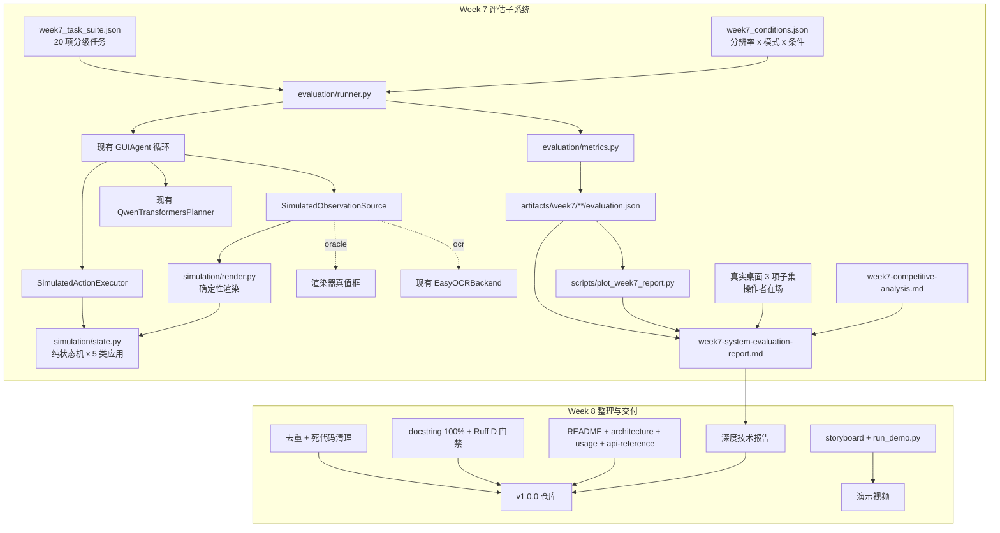

# 桌面 GUI 智能体项目：第 7-8 周执行计划

> **For agentic workers:** 按 Task 顺序执行；每个功能先写测试（RED）再实现（GREEN）；提交或创建 PR 前完成全量验收清单（Task 19）。

**状态：** Week 7 执行中。Week 6 PR #6 已合并到 `master`（merge commit `e251f0c`），Week 7 隔离分支 `codex/week7-system-evaluation` 已从该合并点创建。

**任务分类：** Week 7 为新增子系统（模拟桌面 + 评估框架），Week 8 为全仓库重构与文档收尾。两周各自独立分支与 PR，不在 Week 6 分支上叠加。

**Goal:** 在 Week 6 的鲁棒 Agent v2 之上，建立一套可无人值守、可复现、跨分辨率跨应用的 20 项桌面任务定量评估体系并产出《系统全面评估报告》与可视化图表（第 7 周）；随后完成代码整理、全量注释、文档体系重建、深度技术报告与演示视频脚本，交付可作为求职作品集的 v1.0 仓库（第 8 周）。

**Architecture:** 第 7 周把现有 `examples/gui_testbed.py` 中与 Tk 解耦的纯状态机提升为 `src/gui_agent/simulation/` 包，加上确定性渲染器和一对实现现有 `ObservationSource` / `PlannedActionExecutor` 协议的模拟适配器。这样**真实的 `GUIAgent` 循环、真实的 Qwen planner、真实的 EasyOCR** 可以在完全进程内的合成桌面上端到端运行，既不碰鼠标键盘也不需要逐动作人工确认，从而让 20 项任务 × 3 分辨率的矩阵可以无人值守跑完。真实桌面只保留一个操作者在场的小样本子集，用于量化 sim-to-real 差距，绝不混入自动指标。第 8 周不新增运行时功能，只做去重、注释、文档、报告和发布。

**Tech Stack:** Python 3.11、uv、PyTorch CUDA 12.8、Transformers、PEFT、Qwen3-VL-4B-Instruct、Pydantic、OpenCV、Pillow、EasyOCR、Matplotlib（新增 `viz` 可选依赖）、pytest、Ruff、mypy。

**Spec:** `docs/大模型 AI Agent 算法岗位线上实习项目大纲：基于多模态大模型的桌面 GUI 智能体开发与优化.pdf`，重点为第 3 页的第 7、8 周表格与第 3-5 页的技术栈、合规说明。上游基线见 `docs/PROJECT_PLAN_WEEKS_5_6.md`。

---

## 1. PDF 任务确认

### 1.1 第 7 周：系统全面评估与性能分析

PDF 明确要求：

1. 设计包含 20 个不同难度桌面任务的测试集。
2. 从任务成功率、平均执行时间、错误率等维度进行定量评估。
3. 分析系统在不同应用、不同分辨率下的表现差异。
4. 对比本项目实现与 Ui-TARS、Claude Computer Use 的技术差距。

**PDF 交付物：** 《系统全面评估报告》+ 性能分析可视化图表。
**PDF 工具：** 自行设计的测试任务集、Excel/Google Sheets 数据统计、Matplotlib 数据可视化库。

### 1.2 第 8 周：项目总结与求职作品集整合

PDF 明确要求：

1. 撰写完整的技术报告，详细阐述技术架构、实现细节、实验结果与创新点。
2. 制作系统演示视频，展示核心功能与效果。
3. 整理项目代码，添加详细注释与使用说明。

**PDF 交付物：** 完整项目代码仓库 + 深度技术报告 + 系统演示视频。
**PDF 工具：** 前序所有交付物、剪映/必剪、Markdown 编辑器、LaTeX 编辑器。

### 1.3 本计划的解释边界

- **“20 个桌面任务”指本地合成桌面任务，不是真实第三方应用任务。** 项目自身的安全规则要求每个真实桌面动作都由操作者逐字输入 `EXECUTE ACTION`；20 任务 × 3 分辨率 × 平均 3 动作 ≈ 180 次人工确认，既不可复现也无法在合规前提下无人值守。因此主指标来自进程内模拟桌面，真实桌面只做 3 项子集抽查。报告必须显式声明这一点，不得把模拟成功率表述为真实桌面成功率。
- **“不同应用”指 5 类应用原型**（浏览器、文件管理器、消息、设置表单、文本编辑器），由模拟桌面渲染，不安装、不启动、不登录任何第三方软件。
- **“不同分辨率”指渲染画布尺寸** 1280×720 / 1920×1080 / 2560×1440。真实 Windows 的 DPI 缩放、远程桌面和多显示器偏差属于已知限制，只在真实子集里定性记录。
- **“对比 Ui-TARS / Claude Computer Use”是架构与能力差距分析，不是同台跑分。** 它们的公开数字来自 OSWorld、AndroidWorld、ScreenSpot 等外部基准，与本项目 n=20 的合成任务集不可比。报告只做架构对照表 + 有出处的公开指标引用 + 明确的不可比声明，禁止编造或换算数字。
- **“统计工具”用 Python + Matplotlib 完成，不引入 Excel/Google Sheets 依赖。** 需要表格时导出 CSV，用户可自行在 Excel 打开。
- **Week 8 的“详细注释”指 `src/` 下 100% 模块 / 公开类 / 公开函数具备 docstring，并由 Ruff `D` 规则在 CI 中强制**，而不是逐行行内注释。行内注释只在意图不能由命名和类型表达时添加。
- 评估产物（`artifacts/week7/**`）、图表 PNG/SVG、模型权重、真实截图和演示视频原片保持 Git 忽略。仓库只提交代码、配置、任务集、汇总指标 JSON、文档和图表生成脚本。

---

## 2. 当前基线与开始条件

### 2.1 已验证的基线（2026-09-09 本机实测）

在 `.worktrees/week6-robust-agent-v2` 上：

```text
ruff check .                                  All checks passed
mypy src tests examples scripts               Success: no issues found in 89 source files
pytest -m "not integration"                   404 passed, 10 deselected
覆盖率                                        87%（3577 语句 / 459 未覆盖）
```

覆盖率最低的模块（Week 7/8 补测试时优先）：`training/trainer.py` 55%、`datasets/webarena.py` 71%、`datasets/cli.py` 77%、`datasets/screenagent.py` 79%、`agent/policy.py` 80%、`training/evaluation.py` 80%、`training/lora.py` 81%、`agent/qwen.py` 82%。

> **本机注意：** 系统临时目录 `C:\Users\...\AppData\Local\Temp\pytest-of-jbc51` 当前不可写，直接 `pytest` 会产生 71 个 `PermissionError` setup 错误。**所有 pytest 命令必须显式加 `--basetemp`**，例如 `--basetemp artifacts/pytest-week7`。这不是代码缺陷，需写入贡献者文档。

### 2.2 现有能力（Week 1.6 - Week 6）

| 层 | 模块 | 能力 |
|---|---|---|
| 类型 | `types.py` | `Point` / `ScreenRegion` / `BoundingBox` / `ScreenshotResult` / `OCRDetection`，全部 frozen + 校验 |
| 感知 | `perception/capture.py` | MSS 多显示器整屏与绝对区域截图 |
| 感知 | `perception/preprocessing.py` | `fast` / `balanced` / `accurate` 三档 profile 与 CLAHE/缩放 |
| 感知 | `perception/ocr.py` | 可替换 `OCRBackend` 协议 + EasyOCR 后端，坐标还原到绝对屏幕坐标 |
| 感知 | `perception/benchmark.py` | 合成 UI 的 precision/recall/F1 与 median/p95 延迟 |
| 感知 | `perception/localization.py` | 精确/包含查找与非破坏式标注 |
| 控制 | `control/controller.py` | 默认 dry-run，PyAutoGUI fail-safe，白名单按键与边界校验 |
| Agent | `agent/types.py` | 严格 `AgentAction` 联合、`TaskPlan`、`PlanProgress`、`VerificationResult`、`RetryDecision` |
| Agent | `agent/planner.py` / `qwen.py` | fake / OpenAI-compatible / 本地 Qwen3-VL，含 LoRA adapter 校验加载 |
| Agent | `agent/policy.py` | 模型动作安全校验 + 逐动作 `EXECUTE ACTION` 确认 |
| Agent | `agent/loop.py` | 观察→规划→授权→执行→验证→恢复，限次 retry / 1 次 replan / 禁止重放 |
| Agent | `agent/events.py` | 脱敏结构化事件流（goal 只存 SHA-256，OCR 只存数量与摘要哈希） |
| 数据 | `datasets/` | ScreenAgent / Mind2Web / WebArena 确定性预处理与 manifest |
| 训练 | `training/` | 无 episode 泄漏切分、4-bit QLoRA、adapter manifest、5 例固定离线评测 |

### 2.3 Week 7 开始前必须满足

1. **Week 6 PR 合并到 `master`。** 当前 `origin/master` 仍停在 Week 5 合并点 `8314fdc`；`codex/week6-robust-agent-v2`（`a8194f5`）在其之上有 7 个提交未合并。
2. 合并后的 `master` 上 `uv lock --check`、ruff、mypy、`pytest -m "not integration"` 全绿。
3. 从更新后的 `origin/master` 创建新 worktree，**不得**在 Week 6 分支上继续实现。
4. 主检出当前停在过期的 `agent/week2-perception-control`，且有未提交的 `.gitignore` 改动（新增 `.worktrees/`）与未跟踪的 `tools/`、`reports/`。这些属于用户文件，Week 7 期间不得覆盖或误提交；其归属在 Week 8 Task 18 统一处理。

建议分支：

- Week 7：`codex/week7-system-evaluation`
- Week 8：`codex/week8-portfolio`

---

## 3. 方案选择

| 决策 | 采用方案 | 原因 |
|---|---|---|
| 20 项任务的运行载体 | 进程内模拟桌面（`src/gui_agent/simulation/`） | 唯一能在项目安全规则下无人值守、可复现、可跨分辨率重跑的方案；真实桌面每个动作都需人工确认 |
| 模拟桌面来源 | 提升现有 `examples/gui_testbed.py` 的 `TestbedState` | 该状态机已与 Tk 解耦且经 Week 6 验证，复用胜过新写 |
| 被测链路 | 真实 `GUIAgent` + 真实 Qwen planner + 真实 EasyOCR，只替换最外层 observe/execute 适配器 | 保证测的是本项目的完整感知—规划—控制链路，而不是一个玩具 |
| OCR 维度 | 同时跑 `oracle`（渲染器直接给真值框）和 `ocr`（真实 EasyOCR 识别渲染帧）两种模式 | `oracle` 给出规划能力上界，`ocr` 给出端到端真实值，两者之差即感知损失，可直接支撑“感知优化”论述 |
| 真实桌面 | 3 项任务、1 个分辨率、操作者在场逐动作确认，单独成节 | 量化 sim-to-real 差距而不污染自动指标 |
| 指标口径 | 成功率 / 中位与均值执行时间 / 按 `FailureReason` 分类的错误率 / 步数 / retry / replan / 验证通过率 | 前三项是 PDF 明确要求，后四项是 Week 6 已有的一等公民字段，零额外成本 |
| 结果落盘 | `kind: gui-agent-week7-evaluation` 的 schema 化 JSON + 每次运行的 `events.jsonl` | 与 Week 5 `EvaluationReport`、Week 6 事件流的既有纪律一致，可哈希、可复现、拒绝覆盖非本类文件 |
| 与 Week 5 评估的关系 | 保留两套（Week 5 是单轮模型打分，Week 7 是多步任务执行），只抽取共享的 condition 溯源与写盘助手 | 强行合并会把两种语义混进一个 schema，得不偿失 |
| 可视化 | Matplotlib + `Agg` 后端，新增 `viz` 可选依赖组 | PDF 指定 Matplotlib；`viz` 不进入默认 CI 同步，保持 CI 无 GUI 无模型 |
| 竞品对比 | 架构能力矩阵 + 有出处的公开指标 + 显式不可比声明 | 没有条件复现 OSWorld 等外部基准，编造或换算数字不可接受 |
| Week 8 注释语言 | docstring 用英文（与代码、类型标注一致），中文长篇解释放 `docs/` | 避免同一文件中英混排，也避免后续反复改写 |
| 注释强制手段 | Ruff `D` 规则进 CI，`tests/` 豁免 | 让“100% 注释”成为可验证门禁而不是口号 |
| 磁盘 schema 中的 `week5` 字面量 | **冻结不改** | `gui-agent-week5-training-run` 等是已写入本地 adapter/manifest 的数据契约，改名会让现有产物全部失效；只在文档中说明其历史含义 |

不采用：为凑成功率而放宽 `finish` 验证门槛；把 dry-run 计入成功；在无人值守下调用真实鼠标键盘；把竞品公开分数与本项目分数并列成一张“跑分表”。

---

## 4. 目标架构



### 4.1 关键设计约束：模拟执行器绝不能返回 `dry_run`

已在本机验证的行为：

```powershell
uv run gui-agent run --task "demo probe" --provider fake --max-steps 5
# {"status": "succeeded", "message": "Synthetic dry-run completed", ..., "dry_run": true}
```

`RuleBasedOutcomeVerifier` 对 `status == "dry_run"` 会**提前返回 `passed=True` 并附带 `dry_run_preview` 证据**（`verification.py:77-84`），该证据把 `loop.py:468` 的 `has_verification_evidence` 置真，从而让最终 `finish` 通过 `loop.py:498` 的完成门禁。这在 fake smoke 场景中是有意为之，但如果 Week 7 的任何条件跑在 dry-run 下，成功率会被系统性虚高。因此：

1. 模拟执行器真正改变模拟状态，返回 `status="executed"`；
2. Week 7 runner 在写盘前断言本次运行不含任何 `dry_run` 状态的 `StepResult`，否则整条记录标记为 `invalid` 并排除在分母之外；
3. Task 4 必须新增一个专门钉死该语义的测试——当前 404 项测试**没有**覆盖 `dry_run_preview` 与完成门禁的交互。

---

## 5. 计划文件布局

```text
新增：
src/gui_agent/simulation/__init__.py
src/gui_agent/simulation/state.py          # 纯状态机（从 examples/gui_testbed.py 提升）
src/gui_agent/simulation/apps.py           # 5 类应用原型的控件定义
src/gui_agent/simulation/render.py         # 确定性渲染 + 控件命中框
src/gui_agent/simulation/harness.py        # SimulatedObservationSource / SimulatedActionExecutor / SimulationPolicy
src/gui_agent/evaluation/__init__.py
src/gui_agent/evaluation/suite.py          # 任务集 schema 与加载
src/gui_agent/evaluation/runner.py         # 矩阵展开、单任务执行、断点续跑
src/gui_agent/evaluation/metrics.py        # 成功率/时间/错误率/步数聚合
src/gui_agent/evaluation/report.py         # 报告 schema 与写盘
src/gui_agent/evaluation/plots.py          # Matplotlib 图表函数
src/gui_agent/evaluation/cli.py            # gui-agent evaluate 子命令
src/gui_agent/provenance.py                # 共享的 condition 溯源与哈希写盘助手
configs/week7_task_suite.json              # 20 项分级任务
configs/week7_conditions.json              # 运行矩阵
scripts/plot_week7_report.py
docs/analysis/week7-competitive-analysis.md
docs/test-reports/week7-system-evaluation-report.md
docs/test-reports/week7-real-desktop-subset.md
docs/architecture.md / usage.md / api-reference.md / safety.md / contributing.md / INDEX.md
docs/technical-report/gui-agent-technical-report.md
docs/demo/storyboard.md / recording-checklist.md
scripts/run_demo.py
tests/test_simulation_state.py / test_simulation_render.py / test_simulation_harness.py
tests/test_evaluation_suite.py / test_evaluation_runner.py / test_evaluation_metrics.py
tests/test_evaluation_report.py / test_evaluation_plots.py
tests/integration/test_week7_task_suite.py

修改：
examples/gui_testbed.py                    # 改为 simulation 包的 Tk 外壳
src/gui_agent/cli.py                       # 注册 evaluate 子命令、清理 Week 4 字样
pyproject.toml                             # viz 可选依赖、Ruff D 规则、version 1.0.0
.github/workflows/ci.yml                   # docstring 门禁
README.md                                  # 项目级重写
```

---

# 第 7 周执行计划

## Task 0: 前置门禁与 Week 7 worktree

**Files:** 无代码改动

- [x] **Step 1: 合并 Week 6**

确认 `codex/week6-robust-agent-v2` 的 PR 已评审并合并到 `master`。若尚未合并，本周不得开始。

- [x] **Step 2: 验证合并后的 master**

```powershell
git fetch origin
git switch master
git pull --ff-only
uv lock --check
uv run ruff check .
uv run mypy src tests examples scripts
uv run pytest -m "not integration" --basetemp artifacts/pytest-week7-gate --cov=gui_agent --cov-report=term-missing
```

期望：ruff/mypy 全绿，404 项测试通过，覆盖率 ≥ 87%。**记录这三个数字**，Week 7/8 结束时不得回退。

- [x] **Step 3: 创建 worktree**

```powershell
git worktree add .worktrees/week7-system-evaluation -b codex/week7-system-evaluation origin/master
```

执行记录（2026-09-09）：`uv lock --check`、Ruff、mypy 全部通过；非集成测试
`404 passed, 10 deselected`；覆盖率 `87%`（3577 条语句 / 461 条未覆盖）。主检出的
用户改动未被触碰。

---

## Task 1: 提升模拟桌面内核为一等公民模块

**Files:**
- Create: `src/gui_agent/simulation/__init__.py`
- Create: `src/gui_agent/simulation/state.py`
- Create: `src/gui_agent/simulation/apps.py`
- Create: `src/gui_agent/simulation/render.py`
- Modify: `examples/gui_testbed.py`
- Create: `tests/test_simulation_state.py`
- Create: `tests/test_simulation_render.py`

**Produces:** 一个与 Tk 完全解耦、可在任意画布尺寸下确定性渲染的 5 应用模拟桌面。

- [x] **Step 1: RED**

覆盖：每类应用的状态迁移与非法输入拒绝；文件操作不越出 sandbox root；同一状态 + 同一画布尺寸渲染出**逐字节相同**的图像；不同画布尺寸下控件命中框按比例缩放且互不重叠；控件文字在最小画布下仍完整可见（不被裁切）。

```powershell
uv run pytest tests/test_simulation_state.py tests/test_simulation_render.py -v --basetemp artifacts/pytest-week7-t1
```

- [x] **Step 2: 迁移纯状态机**

把 `examples/gui_testbed.py` 的 `TestbedState` 移到 `src/gui_agent/simulation/state.py`，保留 `fault_profile`（`none` / `transient` / `delayed`）语义与 `snapshot()`。`examples/gui_testbed.py` 只保留 `TestbedApp` 这层 Tk 外壳并从新包导入，Week 6 的手动 testbed 用法保持不变。

- [x] **Step 3: 扩展到 5 类应用原型**

在 `apps.py` 中声明式定义控件（`id`、`role`、相对坐标 `0.0-1.0`、标签、可交互性）：

| 应用 | 控件要点 | 支持的动作 |
|---|---|---|
| `browser` | 地址栏、搜索框、Search 按钮、结果面板、两个标签页 | click / type_text / wait |
| `files` | 文件名输入、Open 按钮、内容面板、可滚动列表 | click / type_text / scroll |
| `messages` | 收件人、正文、Send 按钮、收件箱列表 | click / type_text |
| `settings` | 复选框、下拉、滑块、Save/Cancel 按钮 | click / hotkey / drag |
| `editor` | 文本区、查找框、Ctrl+A / Ctrl+S 快捷键、状态栏 | click / type_text / hotkey / scroll |

相对坐标是跨分辨率的关键：渲染时乘以画布尺寸取整，因此同一任务在三种分辨率下语义完全一致。

- [x] **Step 4: 确定性渲染器**

`render.py` 用 Pillow 绘制并转为 `uint8` BGR `ImageArray`（与 `training/evaluation.py:_render_case` 同一套路，但支持任意尺寸和多控件）。要求：

- 固定字体与固定颜色，禁止任何随机数、时间戳或抗锯齿差异进入像素；
- 返回 `(image, hitboxes)`，`hitboxes` 为 `dict[str, BoundingBox]`（绝对像素）；
- 字号随画布尺寸线性缩放，保证 1280×720 下 OCR 仍可读。

- [x] **Step 5: GREEN 与提交**

```powershell
uv run pytest tests/test_simulation_state.py tests/test_simulation_render.py tests/test_examples.py -v --basetemp artifacts/pytest-week7-t1
uv run mypy src/gui_agent/simulation examples/gui_testbed.py
git add src/gui_agent/simulation examples/gui_testbed.py tests/test_simulation_state.py tests/test_simulation_render.py
git commit -m "feat: add a headless simulated desktop for evaluation"
```

---

## Task 2: 模拟观察源与执行器

**Files:**
- Create: `src/gui_agent/simulation/harness.py`
- Create: `tests/test_simulation_harness.py`

**Produces:** 一对实现现有协议的适配器，让真实 `GUIAgent` 可以在模拟桌面上无人值守运行。

- [x] **Step 1: RED**

覆盖：`oracle` 模式返回渲染器真值框；`ocr` 模式调用注入的 `OCRBackend`；点击命中/未命中控件的状态差异；越界坐标被拒绝；不支持的动作返回 `status="failed"` 而不是抛穿；`wait` 推进模拟时钟并触发 `delayed` 故障完成；**执行器永不返回 `status="dry_run"`**；`SimulationPolicy` 不调用 `input()`。

- [x] **Step 2: `SimulatedObservationSource`**

```python
class SimulatedObservationSource:
    """Render the simulated desktop and describe it the way perception would."""

    def __init__(
        self,
        desktop: SimulatedDesktop,
        *,
        mode: Literal["oracle", "ocr"],
        ocr: OCRBackend | None = None,
        min_confidence: float = 0.5,
    ) -> None: ...

    def observe(self, step_index: int) -> Observation: ...
```

`oracle` 模式把 `hitboxes` 直接转成 `confidence=1.0` 的 `OCRDetection`；`ocr` 模式把渲染帧交给真实 `EasyOCRBackend`。两种模式产出的 `Observation` 类型完全一致，因此下游 `GUIAgent` 不需要任何分支。

- [x] **Step 3: `SimulatedActionExecutor`**

对 `ClickAction` 做命中测试（落在哪个 hitbox 内），转成状态机调用；`TypeTextAction` 写入当前焦点控件；`HotkeyAction` 匹配应用声明的快捷键；`ScrollAction` 移动列表偏移；`DragAction` 移动滑块；`WaitAction` 推进注入的模拟时钟；`FinishAction` 不改变状态。返回 `StepResult(status="executed", ...)`。

- [x] **Step 4: `SimulationPolicy`**

复用 `SafetyPolicy._validate` 的全部边界校验（坐标在观察内、按键在白名单、文本长度），但**不做人工确认**。命名必须让人一眼看出它只用于模拟：类 docstring 第一句写明 “Never authorizes real desktop input.”

> **不要**给 `SafetyPolicy` 加一个 `skip_confirmation=True` 开关——那会在真实路径上开一个可被误用的口子。

- [x] **Step 5: GREEN 与提交**

```powershell
uv run pytest tests/test_simulation_harness.py -v --basetemp artifacts/pytest-week7-t2
uv run mypy src/gui_agent/simulation
git add src/gui_agent/simulation/harness.py tests/test_simulation_harness.py
git commit -m "feat: run the agent loop against the simulated desktop"
```

---

## Task 3: 设计并校验 20 项分级任务集

**Files:**
- Create: `configs/week7_task_suite.json`
- Create: `src/gui_agent/evaluation/__init__.py`
- Create: `src/gui_agent/evaluation/suite.py`
- Create: `tests/test_evaluation_suite.py`

**Produces:** 20 项任务，覆盖 5 类应用 × 3 个难度，每项都有可被现有验证器判定的确定性成功条件。

- [x] **Step 1: RED**

覆盖：schema 校验（ID 唯一、难度枚举、应用枚举、`max_steps` 上界）；**难度与应用分布断言**（5 应用各 4 项；easy 8 / medium 7 / hard 5）；成功条件必须包含单引号引用文本（`RuleBasedOutcomeVerifier` 只认引号内文本，无引用文本会被判 `expected_text_missing`）；**每项任务都能被脚本化的 oracle 解法在 `max_steps` 内走通**。

最后一条是整个 Week 7 的地基：它证明任务集本身可解，因此模型 0% 命中意味着模型不行，而不是任务集设计错误。

- [x] **Step 2: 任务 schema**

```python
class EvaluationTask(_StrictFrozenModel):
    id: str
    app: Literal["browser", "files", "messages", "settings", "editor"]
    difficulty: Literal["easy", "medium", "hard"]
    instruction: str
    success_criteria: str                        # 必须含 '引用文本'
    initial_state: dict[str, object]
    fault_profile: Literal["none", "transient", "delayed"] = "none"
    max_steps: int
    reference_actions: tuple[AgentAction, ...]   # oracle 解法，仅用于可解性验证
    tags: tuple[str, ...] = ()
```

- [x] **Step 3: 20 项任务分布**

| 难度 | 数量 | 特征 | 示例 |
|---|---:|---|---|
| easy | 8 | 单动作，目标控件直接可见 | 点击 Browser 标签页；打开 `demo.txt`；勾选设置项 |
| medium | 7 | 2-3 动作，需要输入 + 确认 | 搜索指定内容并读取结果；发送指定消息；编辑器中 Ctrl+A 后输入 |
| hard | 5 | 4+ 动作，需要滚动/等待/一次重规划 | 延迟结果（`delayed` 故障）；瞬态失败后重试（`transient`）；先切错标签页再纠正；滚动到列表底部再打开条目；表单多字段填写后保存 |

每类应用 4 项，横跨难度。hard 任务刻意触发 Week 6 的 retry / replan / wait 路径，让鲁棒性机制在评估中被真正行使。

- [x] **Step 4: GREEN 与提交**

```powershell
uv run pytest tests/test_evaluation_suite.py -v --basetemp artifacts/pytest-week7-t3
git add configs/week7_task_suite.json src/gui_agent/evaluation tests/test_evaluation_suite.py
git commit -m "feat: define the Week 7 desktop task suite"
```

---

## Task 4: 评估运行器、指标与报告 schema

**Files:**
- Create: `src/gui_agent/provenance.py`
- Create: `src/gui_agent/evaluation/runner.py`
- Create: `src/gui_agent/evaluation/metrics.py`
- Create: `src/gui_agent/evaluation/report.py`
- Create: `tests/test_evaluation_runner.py`
- Create: `tests/test_evaluation_metrics.py`
- Create: `tests/test_evaluation_report.py`
- Modify: `src/gui_agent/training/evaluation.py`、`src/gui_agent/agent/qwen.py`（改用共享溯源助手）

**Produces:** 可复现、带完整溯源、拒绝把 dry-run 计入成功的评估管线。

- [x] **Step 1: RED**

覆盖：成功率/错误率分母口径（`invalid` 运行单列，不进分母）；中位与均值时间；按 `FailureReason` 的错误分类计数；宏平均 vs 微平均；报告 JSON 逐字节确定；拒绝覆盖非 `gui-agent-week7-evaluation` 的文件；断点续跑跳过已完成任务且不改变结果；**含 `dry_run` 状态的运行被标记 invalid**（新增，当前无覆盖）。

- [x] **Step 2: 抽取共享溯源助手**

把 `training/evaluation.py` 中的 `_file_sha256`、`_adapter_provenance`、`write_evaluation_report` 的原子写盘与 `kind` 校验逻辑提到 `src/gui_agent/provenance.py`；`agent/qwen.py:_validated_adapter` 中重复的“run-manifest.json 同级或子级”解析一并合并。

**行为必须完全保持不变**——现有 `tests/test_training_evaluation.py` 的 388 行断言是这次重构的安全网。

- [x] **Step 3: 指标定义**

```python
class TaskOutcome(_StrictFrozenModel):
    task_id: str
    app: str
    difficulty: str
    resolution: tuple[int, int]
    status: Literal["succeeded", "failed", "stopped", "invalid"]
    reason_code: FailureReason | None
    step_count: int
    retry_count: int
    replan_count: int
    verification_pass_rate: float
    wall_ms: float
    planner_ms: float
    perception_ms: float
    execution_ms: float


class SuiteMetrics(_StrictFrozenModel):
    task_count: int
    valid_count: int
    success_rate: float                        # succeeded / valid
    success_rate_by_difficulty: dict[str, float]
    success_rate_by_app: dict[str, float]
    error_rate: float                          # failed / valid
    error_rate_by_reason: dict[str, float]
    stopped_rate: float
    median_wall_ms: float
    mean_wall_ms: float
    p95_wall_ms: float
    median_steps_to_success: float
    mean_retries: float
    mean_replans: float
```

耗时拆分（planner / perception / execution）通过在 harness 与 planner 外包一层计时装饰器采集，不改动 `GUIAgent` 内部。

- [x] **Step 4: Runner**

单任务执行流程：构造模拟桌面 → 构造 harness → 用真实 `GUIAgent` + 真实 planner 运行 → 收集 `AgentRunResult` 与事件 → 转 `TaskOutcome`。`--resume` 时读取已有 `evaluation.json` 跳过已完成条目。每个任务单独写 `artifacts/week7/<condition>/<task_id>/events.jsonl`。

- [x] **Step 5: 报告 schema**

`kind: "gui-agent-week7-evaluation"`，`schema_version: 1`，包含：`suite_sha256`、`conditions_sha256`、`git_revision`、`model`、adapter 三段哈希、`prompt_profile`、`ocr_profile`、`observation_mode`、`seed`、`environment`（torch / transformers / easyocr / opencv 版本）、`metrics`、`outcomes`。

- [x] **Step 6: GREEN 与提交**

```powershell
uv run pytest tests/test_evaluation_runner.py tests/test_evaluation_metrics.py tests/test_evaluation_report.py tests/test_training_evaluation.py -v --basetemp artifacts/pytest-week7-t4
uv run mypy src tests examples scripts
git add src/gui_agent/provenance.py src/gui_agent/evaluation src/gui_agent/training/evaluation.py src/gui_agent/agent/qwen.py tests/
git commit -m "feat: add the Week 7 evaluation runner and metrics"
```

---

## Task 5: 运行矩阵与 CLI

**Files:**
- Create: `configs/week7_conditions.json`
- Create: `src/gui_agent/evaluation/cli.py`
- Modify: `src/gui_agent/cli.py`
- Create: `tests/integration/test_week7_task_suite.py`
- Modify: `tests/test_agent_cli.py`

**Produces:** `gui-agent evaluate` 子命令与预算受控的运行矩阵。

- [x] **Step 1: RED**

覆盖：矩阵展开的笛卡尔积与去重；condition ID 唯一且包含全部区分字段；CLI 参数校验；`--dry-run-plan` 只打印将要执行的运行数与预估耗时而不执行；integration 标记的全套件 fake-planner 冒烟（20 项任务在 fake planner 下全部走通，验证管线本身）。

- [x] **Step 2: 运行矩阵与预算**

| 条件 | 任务 | 分辨率 | 观察模式 | 运行数 | 预估耗时 |
|---|---:|---|---|---:|---|
| 主矩阵 | 20 | 1280×720 / 1920×1080 / 2560×1440 | `ocr` | 60 | ~50 min |
| 能力上界 | 20 | 1920×1080 | `oracle` | 20 | ~15 min |
| 提示词 A/B | 20 | 1920×1080 | `ocr`，`week5-grounded` | 20 | ~17 min |
| Week 5 adapter | 20 | 1920×1080 | `ocr`，加载 adapter | 20 | ~28 min |
| **合计** | | | | **120** | **~110 min** |

耗时基于 Week 5 实测的单次推理中位 6.4 s（adapter 条件 10.1 s）与平均每任务约 3 次推理。加载 adapter 的一组按 Week 5 结论预期不会更好，跑它是为了在最终报告中给出**多步任务**上的证据——Week 5 只有单轮证据。

- [x] **Step 3: CLI**

```powershell
uv run gui-agent evaluate `
  --suite configs/week7_task_suite.json `
  --conditions configs/week7_conditions.json `
  --output artifacts/week7 `
  --provider qwen `
  --resume
```

在 `src/gui_agent/cli.py` 中按现有 `dataset` / `training` / `model-smoke` 的转发模式注册 `evaluate` 子命令。

- [ ] **Step 4: 正式跑批**

先 `--dry-run-plan` 核对运行数，再 fake planner 全套件确认管线，最后跑真实 Qwen 矩阵。原始 JSON 落在被忽略的 `artifacts/week7/`。

- [ ] **Step 5: GREEN 与提交**

```powershell
uv run pytest tests/test_agent_cli.py -v --basetemp artifacts/pytest-week7-t5
uv run pytest tests/integration/test_week7_task_suite.py -m integration -v --basetemp artifacts/pytest-week7-t5-int
git add configs/week7_conditions.json src/gui_agent/evaluation/cli.py src/gui_agent/cli.py tests/
git commit -m "feat: evaluate across resolutions, applications, and conditions"
```

---

## Task 6: Matplotlib 可视化

**Files:**
- Create: `src/gui_agent/evaluation/plots.py`
- Create: `scripts/plot_week7_report.py`
- Create: `tests/test_evaluation_plots.py`
- Modify: `pyproject.toml`（新增 `viz` 可选依赖）

**Produces:** 6 张可复现图表，PNG + SVG 落在被忽略的 `artifacts/week7/figures/`。

- [ ] **Step 1: RED**

覆盖：所有绘图函数在 `matplotlib.use("Agg")` 下运行并产出非空文件；空数据抛明确异常而不是画空图；坐标轴标签、单位与样本量注记存在；无 matplotlib 时用 `pytest.importorskip` 跳过（CI 默认不装 `viz`）。

- [ ] **Step 2: 六张图**

1. 成功率 × 难度（分组柱状，三个分辨率并列）
2. 成功率 × 应用（分组柱状）
3. 成功率与中位耗时 × 分辨率（双轴折线）
4. 错误码分布（堆叠柱状，按 `FailureReason`）
5. 成功任务步数分布（箱线图，按难度）
6. 单步耗时拆解（堆叠柱状：perception / planner / execution）

**每张图必须标注 `n=20`**，并在标题或副标题写明“合成模拟桌面，非真实桌面”。使用色盲安全配色，不要仅靠颜色区分（同时用图案或直接标注数值）。

- [ ] **Step 3: 依赖隔离**

```toml
viz = [
    "matplotlib>=3.9,<4",
]
```

CI 的 `uv sync` 不加 `--extra viz`，保持 CI 无 GUI 依赖。

- [ ] **Step 4: GREEN 与提交**

```powershell
uv sync --extra viz
uv run python scripts/plot_week7_report.py --input artifacts/week7 --output artifacts/week7/figures
uv run pytest tests/test_evaluation_plots.py -v --basetemp artifacts/pytest-week7-t6
git add src/gui_agent/evaluation/plots.py scripts/plot_week7_report.py tests/test_evaluation_plots.py pyproject.toml uv.lock
git commit -m "feat: visualize Week 7 evaluation results"
```

---

## Task 7: Ui-TARS 与 Claude Computer Use 差距分析

**Files:**
- Create: `docs/analysis/week7-competitive-analysis.md`

**Produces:** 有出处、不可比性写明的架构与能力差距分析。

- [ ] **Step 1: 架构对照表**

| 维度 | 本项目 | UI-TARS | Claude Computer Use |
|---|---|---|---|
| 感知 | 截图 + EasyOCR 文本框 | 端到端视觉编码，无外部 OCR | 端到端视觉，模型直接输出坐标 |
| 定位 | OCR 框中心点 + 1000 网格 | 原生 grounding 训练 | 原生 grounding |
| 动作空间 | 7 类严格 Pydantic 动作 | 统一跨平台动作空间 | computer 工具动作集 |
| 规划 | 显式 `TaskPlan` + `PlanProgress` | 模型内隐式 System-2 推理 | 模型内隐式推理 + 工具循环 |
| 记忆 | 最近 3 条结果 + 完成步骤列表 | 长程反思与错误记忆 | 上下文内轨迹 |
| 恢复 | 规则验证 + 限次 retry + 1 次 replan | 反思与重试由模型驱动 | 由调用方循环控制 |
| 安全 | 默认 dry-run + 逐动作人工确认 | 无内建人工确认 | 依赖调用方实现 |
| 训练 | 100 条 ScreenAgent 样本的 QLoRA | 大规模 GUI 轨迹预训练 + DPO | 专有训练 |

- [ ] **Step 2: 公开指标引用**

只引用 PDF 参考资料列出的来源（UI-TARS arXiv 2501.12326、Claude Computer Use 官方文档、ScreenAgent、WebArena arXiv 2307.13854）与官方文档，每个数字标注来源与查阅日期。**本机网络受限时先用 `待补充引用` 占位，不得凭记忆填数字。**

- [ ] **Step 3: 不可比声明**

明确写出：它们的分数来自 OSWorld / AndroidWorld / ScreenSpot 等公开基准，本项目的 n=20 合成任务集在任务分布、环境真实度和样本量上均不同，任何跨表比较都无效。本节的价值在于**指出差距来源和补齐所需的工作量**，而不是排名。

- [ ] **Step 4: 差距清单与代价估计**

逐条列出（原生 grounding 训练、大规模轨迹数据、长程记忆、跨平台动作空间……），每条写明“若要补齐需要什么”。这是技术报告“局限与后续”的直接素材。

```powershell
git add docs/analysis/week7-competitive-analysis.md
git commit -m "docs: compare the local agent with UI-TARS and Computer Use"
```

---

## Task 8: 真实桌面小样本子集（操作者在场）

**Files:**
- Create: `docs/test-reports/week7-real-desktop-subset.md`

**Produces:** 量化 sim-to-real 差距的 3 项人工记录，与自动指标严格分离。

- [ ] **Step 1: 选 3 项任务**

从 easy / medium / hard 各取 1 项，且都能在 Week 6 的 Tk testbed 上复现（`browser` 搜索类最合适）。

- [ ] **Step 2: 执行协议**

```powershell
# 终端 1
uv run --no-sync python examples/gui_testbed.py --fault-profile delayed

# 终端 2：先 dry-run 核对坐标与事件
uv run --no-sync gui-agent run --task-id <id> --provider qwen --ocr-profile balanced `
  --max-steps 12 --run-dir artifacts/agent-runs/week7-real-<id>

# 核对无误后才由操作者显式追加 --execute，并对每个动作逐字输入 EXECUTE ACTION
```

- [ ] **Step 3: 记录表**

每项记录：是否成功、步数、墙钟耗时、人工确认次数、OCR 是否错认、坐标偏差、与模拟结果的差异。**不提交截图、完整 OCR 文本或输入全文。**

- [ ] **Step 4: sim-to-real 结论**

给出一句可辩护的结论，例如“3 项中 N 项与模拟结果一致，差异集中在 X”。样本量为 3，只能定性，不能外推——必须写明。

---

## Task 9: 《系统全面评估报告》

**Files:**
- Create: `docs/test-reports/week7-system-evaluation-report.md`

沿用 Week 6 报告的结构与诚实度标准：

1. **结论**（3-5 句，含最重要的一个数字和最重要的一条限制）
2. **运行配置**（模型、adapter、OCR profile、观察模式、分辨率、seed、环境版本、git revision、各文件 SHA-256）
3. **任务集设计**（20 项分布表 + 可解性验证说明）
4. **主结果**（总成功率、错误率、中位/均值耗时）
5. **难度维度**（表 + 图 1）
6. **应用维度**（表 + 图 2）
7. **分辨率维度**（表 + 图 3）
8. **错误分类**（按 `FailureReason` 的表 + 图 4；每类给 1 个具体例子）
9. **步数与恢复行为**（图 5；retry / replan 触发次数）
10. **耗时拆解**（图 6；感知 vs 规划 vs 执行占比）
11. **条件对比**（base vs `week5-grounded` vs adapter vs oracle 上界）
12. **真实桌面子集**（Task 8 结果，单独成节并标注非自动指标）
13. **与 UI-TARS / Computer Use 的差距**（引 Task 7）
14. **全量自动验收**（命令 + 结果）
15. **已知限制**（合成环境、n=20、单机单 seed、未覆盖 DPI 缩放、无第三方应用、竞品数字不可比）

```powershell
git add docs/test-reports/week7-system-evaluation-report.md
git commit -m "test: report the Week 7 system evaluation"
```

---

## Task 10: Week 7 验收与 PR

- [ ] `uv lock --check`
- [ ] `uv run ruff check .`
- [ ] `uv run mypy src tests examples scripts`
- [ ] `uv run pytest -m "not integration" --basetemp artifacts/pytest-week7-final --cov=gui_agent --cov-report=term-missing`（覆盖率 ≥ 87%）
- [ ] `uv run pytest -m integration --basetemp artifacts/pytest-week7-final-int`
- [ ] `git status` 确认无 `artifacts/`、图表、模型权重、截图被跟踪
- [ ] README 增加 Week 7 章节与复现命令
- [ ] 创建 PR

---

# 第 8 周执行计划

## Task 11: 合并 Week 7 并创建 Week 8 worktree

同 Task 0 的门禁流程，分支 `codex/week8-portfolio`。

---

## Task 12: 死代码与重复清理

**约束：** 全部行为保持不变；每一处改动都由现有测试覆盖；改完 404+ 项测试仍全绿且覆盖率不降。

- [ ] **Step 1: 删除死代码**

| 位置 | 问题 | 处理 |
|---|---|---|
| `src/gui_agent/agent/observation.py:79` `ObservationBuilder.clear_cache` | 全仓库无调用者、无测试 | 删除；若 Week 7 runner 需要跨任务清缓存，则改为在那里使用并补测试 |

- [ ] **Step 2: 合并重复实现**

| 重复项 | 出现位置 | 处理 |
|---|---|---|
| `class _StrictFrozenModel` | `agent/types.py:9`、`datasets/schema.py:11`、`training/schema.py:11`、`training/evaluation.py:44` | 提到 `src/gui_agent/_models.py`，四处改为导入 |
| `_positive_integer` / `_non_negative_integer` | `cli.py:93`、`datasets/cli.py:16`、`training/cli.py:27`、`scripts/benchmark_ocr.py:11,18` | 提到 `src/gui_agent/cli_args.py` |
| `_default_processor_loader` / `_default_model_loader` | `agent/qwen.py:41,48`、`training/lora.py:34,41` | 提到 `src/gui_agent/model_loading.py` |
| adapter manifest 解析（“run-manifest.json 同级或子级”） | `agent/qwen.py:_validated_adapter`、`training/evaluation.py:_adapter_provenance` | 合并到 Week 7 建立的 `provenance.py` |
| 帧指纹哈希 | `agent/verification.py:_frame_fingerprint`、`agent/observation.py:_frame_cache_key` | 提到 `perception/fingerprint.py` |
| OCR 文本规范化 | `agent/verification.py:_normalized_text`、`perception/benchmark.py:normalize_text`、`agent/events.py:observation_metadata` 内联 | 统一到 `perception/text.py:normalize_text` |
| 数据集许可常量 | `datasets/pipeline.py:_SOURCE_METADATA`、`training/dataset.py:_SOURCE_LICENSES` | 单一来源放 `datasets/sources.py` |

- [ ] **Step 3: 明确不做的事**

- **不改**磁盘 schema 的 `kind` 字面量（`gui-agent-week5-training`、`gui-agent-week5-training-run`、`gui-agent-week5-evaluation`、`gui-agent-week5-training-failure`）。它们是已写入本地 adapter 与 manifest 的数据契约，改名会让现有产物全部作废。只在 `docs/api-reference.md` 中说明其历史含义。
- **不改**指标口径、验证语义或安全策略。清理即清理。

```powershell
uv run pytest -m "not integration" --basetemp artifacts/pytest-week8-t12 --cov=gui_agent --cov-report=term-missing
uv run mypy src tests examples scripts
git commit -m "refactor: remove dead code and consolidate duplicated helpers"
```

---

## Task 13: 全量注释与 docstring 门禁

**现状实测：** 模块 docstring 3/53，公开类 20/110，公开函数 3/170。

- [ ] **Step 1: 约定**

- 语言：英文（与代码、类型标注一致）；中文长篇解释放 `docs/`。
- 风格：单行摘要 + 空行 + 必要的 `Args` / `Returns` / `Raises`。类型信息已在标注中，docstring 不重复类型。
- 内容要求：说明**为什么**和**边界**，不复述函数名。安全相关模块（`agent/policy.py`、`control/controller.py`、`simulation/harness.py`）的类 docstring 第一句必须说明它是否会产生真实桌面输入。

- [ ] **Step 2: 逐包补全**

按 `types.py` → `perception/` → `control/` → `agent/` → `datasets/` → `training/` → `simulation/` → `evaluation/` → `cli.py` 顺序，每包一个提交，便于 review。

- [ ] **Step 3: 门禁**

```toml
[tool.ruff.lint]
select = ["E", "F", "I", "UP", "B", "SIM", "D"]

[tool.ruff.lint.pydocstyle]
convention = "google"

[tool.ruff.lint.per-file-ignores]
"tests/*" = ["D"]
"examples/*" = ["D103"]
```

先加规则跑一遍看告警数量，再逐包补齐到零，最后才把规则合入配置——避免长时间红着。

```powershell
uv run ruff check .
git commit -m "docs: document every public module and API"
```

---

## Task 14: 命名与元数据清理

| 位置 | 现状 | 处理 |
|---|---|---|
| `pyproject.toml` | `version = "0.2.0"`，description 仍是 “perception and control foundations” | 升 `1.0.0`，description 改为完整系统描述 |
| `src/gui_agent/__init__.py:1` | `__version__ = "0.2.0"` | 同步 |
| `cli.py:175` | `description="Safe Week 4 desktop GUI agent prototype"` | 改为项目级描述 |
| `cli.py:44` | `DEFAULT_TASKS_PATH` 指向 `configs/week4_tasks.json`，但其中已含 Week 6 的 `delayed-search` | 更名为 `configs/tasks/local_testbed.json`；`--task-id` 帮助文本同步 |
| `cli.py:223-229` | `--trace-dir` 弃用别名 | v1.0 移除，README/文档说明迁移到 `--run-dir` |
| `cli.py:191,244` | help 文本含 “Week 5” | 改为功能描述 |
| `examples/gui_testbed.py` | 标题 “Week 6 Testbed”、`week4-demo.txt`、`WEEK4_DEMO_READY` | 去掉周次；文件名改 `demo.txt`、标记改 `DEMO_READY`，同步更新任务集 success_criteria |
| `training/cli.py:35,44`、`training/dataset.py:234,245`、`trainer.py:96` | 用户可见文案含 “Week 5” | 改为功能描述（**不动** `kind` 字面量） |

> `configs/week4_tasks.json` 更名会影响 `DEFAULT_TASKS_PATH` 与 Week 6 文档中的命令；同一提交内一并更新 `README.md`、`docs/setup/robust-agent-v2.md` 与相关测试。

```powershell
uv run pytest -m "not integration" --basetemp artifacts/pytest-week8-t14
git commit -m "chore: retire week-numbered names from user-facing surfaces"
```

---

## Task 15: 文档体系重建

- [ ] **Step 1: README 项目级重写**

现有 README 是按周叠加的流水账。v1.0 的 README 应为：项目是什么 → 一张架构图 → **安全模型（放在最前，这是本项目最大的特色）** → 安装 → 60 秒快速开始 → 主要结果摘要（引 Week 7 报告）→ 能力与限制 → 文档索引 → 许可与合规。周次叙事移入 `docs/history/`。

- [ ] **Step 2: 新增文档**

| 文件 | 内容 |
|---|---|
| `docs/architecture.md` | 模块边界、数据流、每个协议（`OCRBackend` / `MultimodalPlanner` / `ObservationSource` / `ActionPolicy` / `PlannedActionExecutor` / `OutcomeVerifier` / `EventSink`）的契约与替换方式 |
| `docs/usage.md` | 全部 CLI 子命令与示例、任务集编写指南、评估复现步骤 |
| `docs/api-reference.md` | 公开 API、所有磁盘 schema（含 `kind` 字面量的历史说明）、事件类型表 |
| `docs/safety.md` | 安全模型全文：dry-run 默认、逐动作确认、fail-safe、脱敏规则、模拟环境与真实环境的界线 |
| `docs/INDEX.md` | 全部文档的一句话索引 |
| `docs/contributing.md` | 开发流程、测试约定、**`--basetemp` 的本机注意事项** |

- [ ] **Step 3: 归档**

`docs/PROJECT_PLAN_WEEKS_*.md` 与 `docs/test-reports/week*.md` 移到 `docs/history/`，在 `INDEX.md` 中标注为历史记录。不要删除——它们是过程证据。

```powershell
git commit -m "docs: restructure the documentation for v1.0"
```

---

## Task 16: 深度技术报告

**Files:** `docs/technical-report/gui-agent-technical-report.md`；可选 `tools/build_technical_report.py`

结构：

1. 摘要
2. 背景与相关工作（UI-TARS / Computer Use / ScreenAgent / WebArena）
3. 系统架构总览
4. 感知子系统（截图、OCR profile、预处理、benchmark 结果）
5. 规划子系统（严格 schema、prompt profile、坐标网格、本地 Qwen 推理）
6. 控制与安全子系统（**本项目的核心创新点**：默认 dry-run、逐动作确认、白名单动作空间、边界校验、fail-safe）
7. 训练与微调（数据切分的无泄漏设计、QLoRA 配置、**诚实报告未获提升的结果**）
8. 鲁棒性机制（计划进度、结果验证、限次恢复、脱敏事件流、Week 6 故障注入结果）
9. 评估方法与结果（Week 7 全部内容）
10. 创新点归纳
11. 局限与后续工作
12. 完整复现步骤
13. 参考文献

**诚实度要求：** Week 5 的 QLoRA 未带来提升，这必须原样写出并分析原因（64 条训练样本、任务分布不匹配、无 grounding 专项数据）。一份写明失败与归因的报告，比一份粉饰的报告更有说服力。

```powershell
git commit -m "docs: add the deep technical report"
```

---

## Task 17: 演示视频脚本与可复现演示

**Files:** `docs/demo/storyboard.md`、`docs/demo/recording-checklist.md`、`scripts/run_demo.py`

- [ ] **Step 1: 分镜脚本**（约 4 分钟）

| 时长 | 镜头 | 内容 |
|---|---|---|
| 0:00-0:20 | 标题 | 项目名、一句话定位、技术栈 |
| 0:20-0:50 | 架构图 | 感知→规划→授权→执行→验证→恢复 |
| 0:50-1:30 | 终端 | dry-run 一个任务：实时事件流、提出的动作、坐标 |
| 1:30-2:10 | 双窗口 | testbed + 终端，逐动作输入 `EXECUTE ACTION`，展示真实控制 |
| 2:10-2:40 | 终端 | 故障注入：瞬态失败 → retry → 成功；额度耗尽 → 受控失败 |
| 2:40-3:20 | 图表 | Week 7 六张图，讲成功率 / 难度 / 分辨率 / 错误分布 |
| 3:20-3:50 | 代码 | 安全策略与严格动作 schema 的关键片段 |
| 3:50-4:00 | 收尾 | 限制与后续工作 |

- [ ] **Step 2: `scripts/run_demo.py`**

把上述终端片段脚本化为固定顺序、固定参数的演示序列，保证每次录制的输出一致，无需临场敲命令。默认只跑模拟与 dry-run；真实控制段落需要显式 `--live` 且仍保留逐动作确认。

- [ ] **Step 3: 录制清单**

录制前必须确认：屏幕上无个人文件名、无 API key、无邮箱、无其他窗口内容；终端字号 ≥ 16pt；窗口 1920×1080；关闭系统通知；`artifacts/` 中无历史个人截图。

```powershell
git commit -m "docs: add the demo storyboard and reproducible demo script"
```

---

## Task 18: 仓库最终整理与发布

- [ ] **Step 1: 处理主检出的未跟踪文件**

| 对象 | 现状 | 建议 |
|---|---|---|
| `.gitignore` 的 `.worktrees/` 行 | 已改未提交 | 提交 |
| `tools/*.py`（4 个 docx 生成器，共约 15 万字符） | 未跟踪 | **纳入仓库**：它们生成正式交付物，是项目资产；补 docstring、补 `--help`、补 `tools/README.md` |
| `tools/__pycache__/` | 未跟踪 | 保持忽略 |
| `reports/*.docx`、`reports/.qa*/` | 未跟踪 | **保持忽略**（生成物 + 含渲染页 PNG）；在 `.gitignore` 中显式加 `reports/` 并说明由 `tools/` 生成 |
| `reports/*.md` | 未跟踪 | 移入 `docs/history/` 并提交（是过程证据） |
| `tmp/pdfs/*.png` | 未跟踪 | 保持忽略 |

- [ ] **Step 2: 分支与 worktree 清理**

合并后删除 `agent/week2-perception-control` 等已合并分支与对应 worktree（`git worktree remove` + `git branch -d`）。

- [ ] **Step 3: 依赖与 CI**

`uv lock --check`；CI 增加 docstring 门禁；确认 CI 仍不下载模型、不截图、不操作输入。

- [ ] **Step 4: 发布**

```powershell
git tag -a v1.0.0 -m "GUI agent v1.0.0"
```

Release notes 汇总：能力、评估结果、限制、复现步骤。**adapter 权重如需发布，走 GitHub Release 附件并由用户逐个确认。**

- [ ] **Step 5: 合规复查**

逐项确认 PDF 第 5 页的 5 条：开源许可遵守、仅用于学习研究、数据来自公开渠道、无个人数据或敏感信息、所有操作在本地进行。

---

## Task 19: 最终验收清单

- [ ] `uv lock --check`
- [ ] `uv run ruff check .`（含 `D` 规则，零告警）
- [ ] `uv run mypy src tests examples scripts`
- [ ] `uv run pytest -m "not integration" --basetemp artifacts/pytest-final --cov=gui_agent --cov-report=term-missing`，覆盖率 ≥ 87%
- [ ] `uv run pytest -m integration --basetemp artifacts/pytest-final-int`
- [ ] `git ls-files` 中无 `*.png`、`*.pdf`、`*.safetensors`、`*.pth`、`artifacts/` 内容
- [ ] `docs/INDEX.md` 中每个链接可达
- [ ] README 的每条命令在干净环境中可执行
- [ ] 三项 PDF 交付物齐备：完整代码仓库 / 深度技术报告 / 演示视频

---

## 6. 命令速查

### 环境

```powershell
Remove-Item Env:VIRTUAL_ENV -ErrorAction SilentlyContinue
uv python install 3.11
uv sync --locked --group dev --extra ocr --extra agent --extra local-model --extra viz
$env:EASYOCR_MODULE_PATH = Join-Path $PWD "models\easyocr"
$env:HF_HOME = Join-Path $PWD ".cache\huggingface"
```

### 第 7 周主流程

```powershell
# 1. 管线冒烟（fake planner，不加载模型）
uv run gui-agent evaluate --suite configs/week7_task_suite.json --conditions configs/week7_conditions.json --provider fake --output artifacts/week7-smoke

# 2. 预览运行矩阵与预估耗时
uv run gui-agent evaluate --suite configs/week7_task_suite.json --conditions configs/week7_conditions.json --dry-run-plan

# 3. 正式跑批（真实 Qwen，约 110 分钟）
uv run gui-agent evaluate --suite configs/week7_task_suite.json --conditions configs/week7_conditions.json --provider qwen --output artifacts/week7 --resume

# 4. 出图
uv run python scripts/plot_week7_report.py --input artifacts/week7 --output artifacts/week7/figures
```

### 第 8 周主流程

```powershell
uv run ruff check .                       # 含 docstring 门禁
uv run python tools/build_technical_report.py
uv run python scripts/run_demo.py         # 录制用的确定性演示
```

### 测试（本机务必带 --basetemp）

```powershell
uv run pytest -m "not integration" --basetemp artifacts/pytest --cov=gui_agent --cov-report=term-missing
uv run pytest -m integration --basetemp artifacts/pytest-int
```

---

## 7. 风险与应对

| 风险 | 影响 | 应对 |
|---|---|---|
| 模拟桌面被质疑“不是真桌面” | 评估结论说服力下降 | 报告首页即声明；配 3 项真实桌面子集量化差距；同时给 `oracle` 上界与 `ocr` 实测值，让感知损失可见 |
| 20 项任务成功率过低（Week 5 显示点击命中率为 0） | 报告结论难看 | 这是**真实结论**，如实报告并归因；`oracle` 模式能区分“看不准”与“不会规划”，这本身就是有价值的发现 |
| 120 次真实推理耗时超预算 | 进度延误 | `--resume` 断点续跑；必要时先交主矩阵 60 次，adapter 组降级为附录 |
| 渲染帧的 OCR 表现与真实应用差异大 | 分辨率结论失真 | 字号随画布线性缩放；Task 1 用测试钉死最小画布下的可读性；限制中写明 |
| 竞品数据无法联网核实 | 分析节缺数字 | 用 `待补充引用` 占位，绝不凭记忆填写；架构对照表本身不依赖数字 |
| Week 8 重构引入回归 | v1.0 不稳定 | 每个清理项单独提交；404+ 项测试与覆盖率是安全网；不动 schema 契约 |
| docstring 门禁一次性开启导致长时间红 | 阻塞开发 | 先跑规则统计数量，逐包补齐，最后才合入配置 |
| 演示视频泄露个人信息 | 合规风险 | 录制清单强制逐项确认；`scripts/run_demo.py` 只用模拟数据与 `artifacts/testbed` |

---

## 8. 参考资料

- 项目大纲 PDF：`docs/大模型 AI Agent 算法岗位线上实习项目大纲：基于多模态大模型的桌面 GUI 智能体开发与优化.pdf`（第 3 页第 7/8 周表格）
- UI-TARS: <https://arxiv.org/abs/2501.12326>
- Claude Computer Use 官方文档：<https://claudecn.com/docs/source-analysis/computer-use/>
- ScreenAgent: <https://github.com/niuzaisheng/ScreenAgent>
- WebArena: <https://arxiv.org/abs/2307.13854>
- 上游计划：`docs/PROJECT_PLAN_WEEKS_1_2.md`、`_3_4.md`、`_5_6.md`
- 上游报告：`docs/test-reports/week2-test-report.md`、`week3-agent-foundation-report.md`、`week5-lora-comparison-report.md`、`week6-robustness-report.md`

---

## 9. 需要用户确认的决策

以下四项会实质改变工作内容，开工前请确认：

1. **主评估载体用模拟桌面**（而非 20 项真实桌面任务）。理由见 1.3 与第 3 节；若坚持真实桌面，需要接受约 180 次人工确认且无法跨分辨率重复。
2. **docstring 用英文**，中文解释放 `docs/`。若希望 docstring 也用中文，请在 Task 13 开始前说明。
3. **`--trace-dir` 在 v1.0 移除**（当前是 `--run-dir` 的弃用别名）。若希望继续保留兼容，Task 14 相应调整。
4. **`tools/` 纳入 Git 仓库**（4 个 docx 生成器），`reports/` 输出保持忽略。若 `tools/` 属于私人脚本不宜公开，改为保持忽略并在文档中说明交付物的生成方式。
