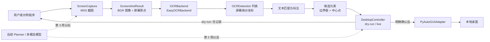

# 桌面感知与控制模块设计

## 1. 目标与范围

本设计从 `PROJECT_PLAN_WEEKS_1_2.md` 的 1.6 开始执行，覆盖：

- Python 3.11 独立开发环境、CUDA/PyTorch 验证和 Windows 配置文档。
- Windows + Python 3.11 的基础 CI。
- 公共坐标与结果类型。
- 多显示器截图、区域截图和显式调试保存。
- EasyOCR 中英文 OCR 后端以及可替换的 `OCRBackend` 接口。
- OCR 文本定位和非破坏式边界框标注。
- 默认 `dry_run` 的安全鼠标键盘控制。
- 不接入大模型的安全端到端演示。
- 单元测试、可选集成测试、覆盖率和第 2 周测试报告。
- 将功能分支推送至 GitHub，并向远程默认分支 `master` 创建草稿 PR。

明确不做第 1 周调研报告、Agent 框架、大模型调用、数据集处理、LoRA 微调或复杂 GUI。

## 2. 已确认约束

- 操作系统：64 位 Windows。
- Python：`>=3.11,<3.12`，不得使用当前系统 Python 3.13 运行项目。
- GPU：NVIDIA GeForce RTX 5070 Ti 16 GB；当前驱动为 595.95。
- 环境与锁文件：沿用远程仓库已有的 `uv`、`.python-version` 和 `uv.lock`。
- OCR：EasyOCR，默认语言为简体中文和英文；通过 PyTorch CUDA 12.8 使用 GPU。
- 图像内部格式：`numpy.uint8` 的 BGR 三通道数组，进入或离开 Pillow 时显式转换 RGB/BGR。
- 坐标：统一使用虚拟桌面的物理屏幕像素坐标，左上为原点；左侧或上方的副显示器可以产生负坐标。
- 安全：控制器和示例默认 `dry_run=True`；单元测试不得移动鼠标、输入文字或保存真实桌面截图。
- 隐私：PDF、桌面截图、模型权重、缓存、日志和 `.env` 不提交 GitHub。

## 3. 方案选择

### 采用：远程基线上的模块化增量实现

保留远程 `master` 已有的 `uv` 配置以及 `perception/`、`control/` 子包，在其上增加公共类型、感知组件、控制组件、示例、测试和文档。EasyOCR 作为可选 OCR 依赖安装在本地 GPU 环境；普通 CI 只运行无需模型下载和真实桌面的测试。

优点是历史连续、依赖可锁定、模块边界清楚，并能在不牺牲 CI 稳定性的情况下验证本机 GPU。

### 未采用：严格重写为计划中的扁平模块

把远程已有目录改成 `capture.py`、`ocr.py`、`control.py` 等顶层文件。它更贴近计划示意树，但会无意义地推翻远程初始化结构，扩大 diff，并降低后续扩展性。

### 未采用：CPU 优先的最小原型

只安装 CPU OCR 并跳过 CUDA 验证。安装更轻，但不满足 1.6 对 RTX 5070 Ti 和 `torch.cuda.is_available()` 的验收要求。

## 4. 架构



模块之间只交换明确的数据类型，不依赖 Agent 框架。截图负责把 MSS 的 BGRA 转成 BGR；OCR 负责把图像局部坐标加上截图原点，输出屏幕绝对坐标；定位模块只返回候选，不自动点击；控制器是唯一允许调用真实桌面 API 的组件。

## 5. 文件与职责

```text
src/gui_agent/
├─ __init__.py                  # 包版本和轻量入口
├─ types.py                     # Point、ScreenRegion、BoundingBox、ScreenshotResult、OCRDetection
├─ perception/
│  ├─ __init__.py               # 感知公共 API
│  ├─ capture.py                # MSS 适配、显示器枚举、整屏/区域截图和显式保存
│  ├─ ocr.py                    # OCRBackend 协议、EasyOCRBackend、图像/置信度校验
│  └─ localization.py           # 精确/忽略大小写/包含匹配以及非破坏式标注
└─ control/
   ├─ __init__.py               # 控制公共 API
   └─ controller.py             # 动作校验、ActionRecord、dry-run 和 PyAutoGUI 适配

tests/
├─ conftest.py                  # 确定性 fake 和合成图像工厂
├─ test_types.py
├─ test_capture.py
├─ test_ocr.py
├─ test_localization.py
└─ test_control.py

examples/
├─ capture_demo.py
├─ ocr_demo.py
├─ control_demo.py
└─ perception_control_demo.py
```

另外更新 `pyproject.toml`、`uv.lock`、`.gitignore`、`README.md`，新增 `.github/workflows/ci.yml`、`docs/setup/windows-setup.md` 和 `docs/test-reports/week2-test-report.md`。

## 6. 公共数据模型与坐标

### `Point`

包含整数 `x`、`y`。屏幕点允许负值，以支持位于主显示器左侧或上方的显示器。

### `ScreenRegion`

包含 `left`、`top`、`width`、`height`。宽高必须为正，`right` 和 `bottom` 采用半开区间计算。它既用于截图请求，也用于虚拟桌面边界校验。

### `BoundingBox`

包含 `left`、`top`、`right`、`bottom`，要求 `right > left` 且 `bottom > top`。EasyOCR 的四边形结果转换为包围它的轴对齐矩形。`center` 返回可点击的整数中心点。

### `ScreenshotResult`

包含 BGR 图像、显示器编号、UTC 截图时间和屏幕绝对原点。宽高从数组派生，避免元数据与真实数组不一致。构造时校验 `uint8`、三通道和非空尺寸。

### `OCRDetection`

包含非空文本、`0.0..1.0` 置信度和屏幕绝对坐标边界框；中心点从边界框派生。

## 7. 组件行为

### 截图

`ScreenCapture` 提供显示器列表、`capture_monitor()` 和 `capture_region()`。显示器编号按 MSS 约定使用 `1..N`；虚拟桌面总区域只作为边界信息，不伪装成物理显示器。区域必须完全处于虚拟桌面范围。默认只返回内存结果，仅在调用方显式传入路径时保存调试图像。

MSS 通过小型适配边界注入测试 fake，因此单元测试验证真实的参数转换、BGRA→BGR、尺寸和错误分支，但不读取真实桌面。

### OCR

`OCRBackend` 定义统一 `recognize(image, origin, min_confidence)` 合约。`EasyOCRBackend` 延迟导入 EasyOCR、延迟创建 Reader，并允许注入 reader factory。默认语言 `("ch_sim", "en")`；未显式指定 GPU 时根据 `torch.cuda.is_available()` 选择。

输入必须是非空 `uint8` 灰度或三通道图像，置信度阈值必须在 `0.0..1.0`。EasyOCR 原始四边形坐标被标准化并加上截图原点。未安装依赖、模型初始化失败和推理失败分别抛出带上下文的项目异常；没有识别结果时返回空列表。

### 定位与标注

文本查找支持精确匹配和包含匹配，两者都可选择英文大小写敏感。结果保持 OCR 顺序；多个匹配全部返回，不替用户选择。

标注函数复制原 BGR 图像，然后绘制边界框、中心点、文本和置信度。高置信度使用绿色，低置信度使用橙色。字体允许调用方覆盖；Windows 默认尝试可显示中文的系统字体，找不到时退化为 Pillow 默认字体。原数组不得发生变化。

### 控制

`DesktopController` 接收 `dry_run`、动作间隔、桌面边界提供器和底层适配器。公开动作包括移动、单击、双击、右击、文本输入、快捷键、垂直滚动和拖拽。

每次动作先校验有限数值、非负持续时间、虚拟桌面边界和合法按键。`dry_run` 只生成不可变 `ActionRecord` 并写日志，不实例化或调用 PyAutoGUI。实时模式启用 `pyautogui.FAILSAFE=True`，并把动作交给唯一的 `PyAutoGUIAdapter`。

端到端示例始终从 dry-run 开始。只有同时提供 `--execute` 且在交互提示中输入完整确认短语时，才允许对唯一候选执行真实点击；零候选或多候选永不自动点击。

## 8. 错误处理与安全边界

- 公共输入错误使用 `ValueError` 的项目子类，错误消息包含参数名和有效范围。
- 可选依赖缺失使用专门的 `OCRDependencyError`，附带安装命令。
- OCR 初始化与推理错误保留原异常作为 `__cause__`，但不吞掉上下文。
- 捕获无效显示器、越界区域和保存失败，并在真正调用桌面 API 前失败。
- 单元测试使用 fake adapter，不 patch 全局鼠标位置，也不调用真实控制 API。
- 集成测试用 `pytest -m integration` 显式运行；普通 `pytest` 和 CI 排除它们。
- 真实截图只用于一次不落盘的本机导入/性能验证，报告不记录屏幕内容。
- OCR 模型缓存和所有运行产物写入已忽略目录。

## 9. 测试与验证

实现使用严格的 Red-Green-Refactor：每个新行为先写会因功能缺失而失败的测试，确认失败原因后写最小实现。

单元测试覆盖：

- 数据类型的合法值、边界值和派生属性。
- 不同显示器尺寸、负原点、区域截图、BGRA 转换和无效参数。
- OCR 空结果、阈值过滤、坐标偏移、非法图像、依赖缺失和模型错误。
- 精确、忽略大小写、包含、多候选、颜色绘制和原图不变。
- 所有控制动作的 dry-run 记录、实时适配调用、越界、非法按键和持续时间。

合成 OCR 图像在测试中生成，覆盖英文、中文、小字体、深色背景、多行和高 DPI 尺寸，不包含个人信息。真实 EasyOCR 模型和真实截图只属于手动集成验证。

完成门禁：

```powershell
uv run ruff check .
uv run mypy src tests
uv run pytest -m "not integration" --cov=gui_agent --cov-report=term-missing
```

CI 在 `windows-latest` 和 Python 3.11 上执行同一组静态检查与普通测试，不下载 OCR 模型，不移动鼠标。

## 10. 环境与依赖策略

- 通过 `uv` 在仓库内创建 `.venv` 并安装 Python 3.11。
- 基础依赖包含 MSS、Pillow、NumPy、OpenCV headless、PyAutoGUI 和 pynput。
- `dev` 组包含 pytest、pytest-cov、ruff 和 mypy。
- `ocr` extra 包含 EasyOCR、PyTorch 和 torchvision；PyTorch 从官方 CUDA 12.8 wheel 索引解析并锁定。
- OCR 模型文件由 EasyOCR 首次集成运行时下载到本地缓存，不进入仓库。
- `docs/setup/windows-setup.md` 记录实际安装命令、版本、GPU 名称、CUDA 可用性和故障排查。

## 11. GitHub 交付

所有实现位于 `agent/week2-perception-control`，基于远程 `master`。提交前显式检查 `git status` 和 diff，只暂存本任务文件。完成全量验证后推送该分支，并创建目标为 `master` 的草稿 PR；PR 描述包含改动、原因、安全影响、验证命令和已知限制。

`v0.2.0-week2` 标签应在 PR 审查并合并到 `master` 后创建，不提前把版本标签放在未合并提交上。
